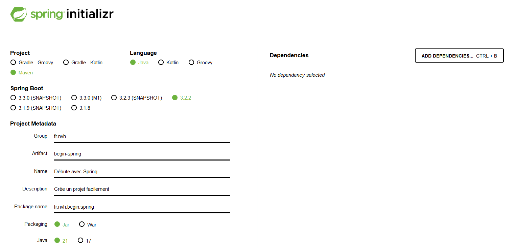
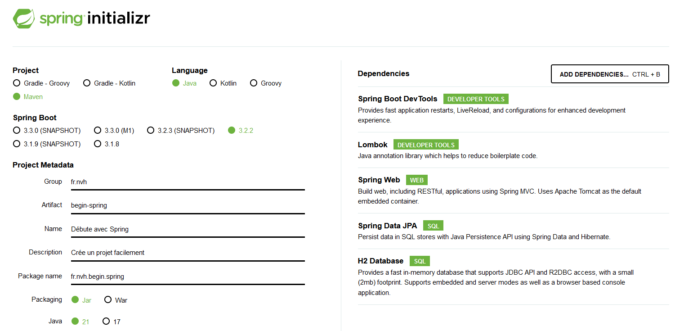

Ce n'est pas toujours facile de se lancer avec Spring quand on est un développeur Java débutant. De premier abord aride avec sa réputation de mastodonte compliqué à appréhender, Spring est pourtant un framework superstar dans la communauté java, et ce n'est pas sans raison.  
Afin de faciliter ta prise en main de Spring, je vais te présenter comment il fonctionne et te donner les clefs qui te permettront de te lancer tout en douceur.

<!--truncate-->


:::warning

Je vais considérer que tu as déjà des bases en Java. Si ce n'est pas le cas, je te conseille de commencer par là. Tu trouveras plein de ressources sur le net pour apprendre Java. J'ai toujours aimé les cours d'[OpenClassrooms](https://openclassrooms.com/fr/courses/6173501-apprenez-a-programmer-en-java), mais il y en a plein d'autres. Et tu pourras trouver quelques conseils sur ce site.

:::

## Spring, un framework Java incontournable

Spring, c'est de la magie : ce framework sait faire plein de choses tout seul, sans que l'on ait besoin de comprendre toutes les mécaniques sous-jacentes. Un avantage certes, mais qui peut rendre parfois son usage déroutant, voire complexe, quand le framework s'emballe et te casse ta belle appli sans que tu ne comprennes pourquoi. [En mode les balais de Fantasia qui se mettent à danser tout seul... et inondent finalement ta baraque](https://youtu.be/snB8u_G3jVI?feature=shared&t=374).

### Spring, le framework pour tous

Spring est un framework opensource Java qui permet de développer plus rapidement des applications complexes et de qualité. Il est très populaire et très utilisé dans le monde professionnel au point où l'on peut dire qu'on ne code plus en Java, mais en Spring. C'est une véritable compétence clef qui peut ouvrir les portes de beaux projets, mais surtout en fermer si on ne le maîtrise pas suffisamment.

Dernièrement, j'ai abordé le sujet de Spring avec des développeurs juniors que j'accompagne. Comme ils sortent d'école et n'ont pas creusé la question de ce framework, je leur ai proposé, afin d'augmenter leurs compétences, de créer un projet perso en Spring. Leur réaction a été unanime :  
"C'est trop gros, trop compliqué, c'est pour des grosses applis."  
Alors... c'est pas faux. Je me souviens moi-même avoir eu des difficultés à m'y mettre lorsque je n'étais encore qu'un débutant.
Et pourtant, aujourd'hui, je ne peux plus m'en passer. Spring est devenu un outil indispensable dans mon quotidien de développeur Java.  

Je te propose de démystifier Spring et de te montrer comment tu peux t'en servir pour créer des applications, quelles que soient la taille et l'ambition de ton projet.

Une fois les concepts de base assimilés, Spring est finalement facile à utiliser, à condition d'y aller doucement et d'avoir déjà quelques bases en Java. Donc go, go, go ! Même à la maison, tu peux springer© (il faut que je le dépose ça...) à volonté.

### Attention à ne pas confondre Spring ou Spring Boot

**Spring** est un framework très modulaire. Il est composé de plusieurs modules, qui peuvent être utilisés indépendamment les uns des autres. 

**Spring Boot** est un module de Spring qui permet de créer et de configurer plus facilement des applications Spring. Il contient aussi un serveur d'application embarqué et des outils pour faciliter le développement (rechargement à chaud, gestion des dépendances, etc).

Donc, tu peux faire du Spring sans Spring Boot, mais tu ne peux pas faire du Spring Boot sans Spring. En fait, Spring Boot est une surcouche de Spring qui te permet de te concentrer sur le développement de ton application sans te soucier de la configuration de Spring. C'est pour ça que je te conseille de commencer par Spring Boot si tu débutes avec Spring. Tu verras, c'est plus simple et plus rapide.

:::info Le moment mnémotechnique

Spring est comme un dojo traditionnel d'arts martiaux, offrant une profondeur d'apprentissage et de pratique. En revanche, Spring Boot est comme un entraînement en plein air, axé sur la simplicité et l'efficacité pour une progression rapide.

:::

### Spring, c'est quoi ?

Spring est un sac de grain de café... Attends, je t'explique...
(Roulement de tambours pour le moment culture générale.)
Si tu ne le sais pas, **java** est un mot anglais pour café. C'est pour ça que le logo de Java (note la majuscule) est une tasse de café fumante _(AAAAHHHH !!!)_ et qu'en Java, on a des **Beans**, des haricots ou des grains de café _(OOOHHHH !!!)_. 
Et comme Spring est un conteneur de Beans, on peut dire que c'est un sac de grain de café.

Garde cette image en tête, ça devrait te permettre de mieux comprendre la suite.

En fait, c'est même encore mieux :  
- Tu décris tes Beans à Spring.
- Il te les fabrique.
- Il te les range sur une étagère, prêts à servir.

Spring initialise tes Beans, les range dans un conteneur, et te les fournit quand tu en as besoin. Et il fait ça tout seul. Et ça, c'est le premier gros point fort de Spring et ça s'appelle l'inversion de contrôle (ou IoC pour les intimes). C'est le premier concept clés de Spring.

Le deuxième concept clef de Spring, c'est qu'il utilise la POO (Programmation Orientée Objet) comme un élément central. À un point qui défie l'imagination d'un débutant. Je ferai peut-être un article à ce sujet. Spring utilise la POO pour faire des trucs tout seul, comme générer des classes entières à partir d'une simple annotation.

En parlant annotations, c'est le cœur de Spring. Tu vas voir, c'est super pratique. Tu écris une annotation au-dessus d'une classe ou d'une méthode, et Spring fait le reste. C'est magique. Littéralement. Avec Spring, quand on me demande "comment on fait ça ?", j'aime répondre :
> Il a une annotation pour ça.

Bref, l'abstraction de Spring est tellement puissante que tu n'as pas besoin de comprendre comment ça marche pour l'utiliser. Mais c'est quand même mieux si tu comprends quand-même. C'est le troisième concept clef de Spring.

:::info Le moment mnémotechnique

Spring, c'est un sac de grain de café, avec un robot qui te les prépare et te les sert quand tu en as besoin. Et la télécommande du robot, ce sont les annotations.

:::

Spring est composé de plusieurs modules, une vingtaine, mais pour débuter, je te conseille de commencer par là :

- **Spring Boot** : c'est le module qui permet de créer des applications Spring autonomes. Il contient aussi un serveur d'application embarqué (Tomcat, Jetty ou Undertow), et des outils pour faciliter le développement (rechargement à chaud, etc).
- **Spring Data** : c'est le module qui permet de manipuler des données dans des bases de données relationnelles ou NoSQL.
- **Spring Web Services** : c'est le module qui permet de développer des applications web services.
- **Spring Test** : c'est le module qui permet de faire des tests unitaires et d'intégration.

:::note

Si tu veux te lancer dans la découverte des autres modules, je te conseille tout simplement la (sacro-sainte) [doc](https://docs.spring.io/spring-framework/docs/4.0.x/spring-framework-reference/html/overview.html)

:::

:::warning Attention aux Chocabugs !

> Spring a un grand pouvoir et un grand pouvoir implique de grandes responsabilités.

Spring, c'est de la magie. Il fait des trucs tout seul et tu ne vas pas toujours comprendre comment il fait. Et c'est à ce moment que tu dois creuser un peu afin de comprendre les mécanismes sous-jacents. Pourquoi ? Parce que sinon, tu vas te retrouver avec des bugs incompréhensibles. Et ça, c'est pas cool. Surtout si tu rajoutes Hibernate et Lombok, et d'autres encore, qui sont aussi des frameworks qui font des trucs tout seul. À coup d'annotations. Et qui sont intégrés à Spring Boot.

Et paf, ça fait des Chocabugs©.

:::

## Initializr : le générateur de projet Spring

[Spring Initializr](https://start.spring.io/) est l'outil de référence pour utiliser Spring Boot et pour cause, c'est l'outil officiel de Spring pour créer des projets Spring Boot. C'est un site qui te permet de créer un projet Spring Boot en quelques clics. 
C'est très pratique pour commencer. Tu choisis les dépendances dont tu as besoin, et il te génère un projet prêt à l'emploi.

Nous allons donc créer un projet Spring Boot avec Spring Initializr. 

### Avant de commencer, présentation des dépendances

Avant de nous lancer dans le vif du sujet, je te présente quelques dépendances de bases, je les mets dans tous mes projets ou presque :

- **Spring Web** : c'est la dépendance qui permet de développer des applications web.
- **Spring Data JPA** : c'est la dépendance qui permet de manipuler des données dans une base de données relationnelle.
- **Spring Boot Test** : c'est la dépendance qui permet de faire des tests unitaires et d'intégration. Tu n'as rien à faire, Spring Initializr ajoute déjà cette dépendance.
- **Lombok** : c'est la dépendance qui permet de générer du code automatiquement. C'est très pratique pour éviter de répéter du code.
- **Spring Boot DevTools** : c'est la dépendance qui permet de recharger à chaud ton application. C'est très pratique pour gagner du temps.

Libre à toi d'en choisir d'autres. Tu peux même en ajouter d'autres plus tard. C'est ça qui est bien avec Spring : tu peux commencer petit et ajouter des choses au fur et à mesure que ton projet grandit.

Petit bonus : Si tu veux une base de données facile et rapide à mettre en place, tu peux ajouter la dépendance **H2 Database**. C'est une base de données relationnelle en mémoire. C'est très pratique pour le démarrage d'une appli. Et tu peux aussi la mettre en fichier pour conserver les données entre deux lancements de l'appli. Et quand tu passeras en production, tu pourras facilement changer pour une autre base de données. H2 mériterait un article à lui tout seul, mais pour l'instant, je te conseille de l'ajouter.

### Créer son premier projet avec Spring Initializr étape par étape

C'est enfin l'heure du tuto !

C'est le moment d'aller sur [Spring Initializr](https://start.spring.io/) pour créer ton projet.
Pour ce faire, tu dois d'abord remplir les champs suivants :

- **Project** : c'est le type de projet. Tu peux choisir Maven ou Gradle. Moi, j'ai l'habitude de Maven, donc je choisis `Maven`.
- **Language** : c'est le langage de programmation. Tu peux choisir Java, Kotlin ou Groovy. Moi, je choisis `Java`.
- **Spring Boot
  ** : c'est la version de Spring Boot. Tu peux choisir la dernière version stable. Moi, je choisis la version `3.2.2`.
- **Project Metadata** : ce sont les informations sur ton projet. Tu peux mettre ce que tu veux. Moi, je mets :
  - **Group** : `fr.nvh`, c'est le nom racine de tous mes packages de toutes mes side projects.
  - **Artifact** : `begin-spring`, c'est le nom de code du projet.
  - **Name** : `Débute avec Spring`, c'est le nom du projet.
  - **Description** : `Un side project pour débuter avec Spring`, c'est la description du projet.
  - **Package name** : `fr.nvh.begin.spring`, c'est le nom du package racine du projet.
  - **Packaging** : `jar`, c'est le type de package généré, tant que tu ne passes pas en production, ça n'a pas d'importance.
  - **Java** : 21, c'est la version de Java, tu peux mettre la dernière version stable.

Et voilà :


:::info

Tu pourras changer toutes ces infos plus tard dans ton fichier de configuration `pom.xml` ou `build.gradle`.

::: 

Voilà pour le travail de base.  
Maintenant, il faut ajouter les dépendances.  
Pour cela, tu cliques sur le bouton **Add Dependencies** et tu ajoutes les dépendances dont je t'ai parlé plus haut. Tu peux aussi ajouter d'autres dépendances si tu veux.

Pour rappel :

- **Spring Web** : c'est la dépendance qui permet de développer des applications web.
- **Spring Data JPA** : c'est la dépendance qui permet de manipuler des données dans une base de données relationnelle.
- **Spring Boot Test** : c'est la dépendance qui permet de faire des tests unitaires et d'intégration.
- **Lombok** : c'est la dépendance qui permet de générer du code automatiquement. C'est très pratique pour éviter de répéter du code.
- **Spring Boot DevTools** : c'est la dépendance qui permet de recharger à chaud ton application. C'est très pratique pour gagner du temps.
- **H2 Database** : c'est la dépendance qui permet d'ajouter une base de données relationnelle en mémoire.



Clic sur le bouton **Generate** et tu auras un fichier zip avec ton projet Spring Boot. Décompresse-le et ouvre-le dans ton IDE préféré.

Faisons-le !

Comme je suis sympa, je te mets le lien vers le projet que j'ai créé : [Spring Initializr - begin-spring](https://start.spring.io/#!type=maven-project&language=java&platformVersion=3.2.2&packaging=jar&jvmVersion=21&groupId=fr.nvh&artifactId=begin-spring&name=D%C3%A9bute%20avec%20Spring&description=Cr%C3%A9e%20un%20projet%20facilement&packageName=fr.nvh.begin.spring&dependencies=devtools,lombok,web,data-jpa,h2)

:::info

Le bouton **Explore** te permet de voir le projet que tu as créé avant de la télécharger. 

:::

### Lancement de l'application du projet généré

Ouvre ton projet dans ton IDE préféré. 

:::info

Moi, j'utilise [IntelliJ IDEA](https://www.jetbrains.com/fr-fr/idea/), mais tu peux utiliser celui que tu veux. La version Community d'IntelliJ IDEA est gratuite et suffisante pour commencer. Je pourrais écrire des tonnes d'articles sur IntelliJ IDEA, et je le ferai prochainement, mais pour l'instant, revenons à Spring.

:::

Alors à quoi ça ressemble ? 
- Un fichier de configuration `pom.xml` (ou `build.gradle`).
- Un fichier `DebuteAvecSpringApplication.java` dans le package `fr.nvh.begin.spring`. C'est la classe de démarrage de ton application. 
- Un fichier `application.properties` dans le dossier `src/main/resources`. C'est le fichier de configuration de ton application. 
- Un fichier `DebuteAvecSpringApplication.java` dans le package `fr.nvh.begin.spring`. C'est le fichier de test de ton application.
- Un fichier `HELP.md` qui contient des informations et des guides sur Spring.

Ignore le reste pour l'instant.

Bon, commençons par le commencement. Le fichier `pom.xml` (ou `build.gradle`). Va jeter un œil, tu y verras toutes les dépendances que tu as ajoutées. Tu pourras aussi y ajouter d'autres dépendances plus tard.

Et tu peux déjà lancer ton application ! Tu verras, ça ne fait pas grand-chose pour l'instant. Mais c'est déjà un bon début.

Regardons un peu ces logs. Tu verras, c'est très verbeux. Mais c'est normal. C'est Spring qui te dit tout ce qu'il fait. Et c'est très pratique pour comprendre ce qui se passe. Intéressons-nous à quelque lignes en particulier :

- Un petit d'ASCII art qui te dit que c'est Spring Boot qui démarre.
  ```
    .   ____          _            __ _ _
   /\\ / ___'_ __ _ _(_)_ __  __ _ \ \ \ \
  ( ( )\___ | '_ | '_| | '_ \/ _` | \ \ \ \
   \\/  ___)| |_)| | | | | || (_| |  ) ) ) )
    '  |____| .__|_| |_|_| |_\__, | / / / /
   =========|_|==============|___/=/_/_/_/
   :: Spring Boot ::                (v3.2.2)
  ```
- Si tu as mis **Spring Boot Devtools**, tu verras une ligne qui te dit que le rechargement à chaud est activé : `LiveReload server is running on port 35729`
- Tu verras aussi deux lignes qui te disent que la base de données est démarrée. 
  - `HikariPool-1 - Added connection conn0: url=jdbc:h2:mem:006fa2a9-f721-437e-ad84-dfc02dc70c38 user=SA` pour la connection à la base de données.
  - `H2 console available at '/h2-console'. Database available at 'jdbc:h2:mem:3e3e3e3e-3e3e-3e3e-3e3e-3e3e3e3e3e3e'` pour t'annoncer que tu peux accéder à la base de données à l'adresse http://localhost:8080/h2-console. Moi, j'adore.
- Tu verras aussi une ligne qui te dit que le serveur d'application est démarré.
  `Tomcat started on port(s): 8080 (http) with context path ''`
- Et tu verras une ligne qui te dit que l'application est démarrée.
  `Started DebuteAvecSpringApplication in 1.5 seconds (JVM running for 2.1)`
- Tu verras aussi des lignes qui te disent qu'Hibernate est lancé.

Du coup, va voir ta base de données ! Tu peux y accéder à l'adresse http://localhost:8080/h2-console, remplis le champ `JDBC URL:` avec l'url que tu trouves dans les logs, ici `jdbc:h2:mem:006fa2a9-f721-437e-ad84-dfc02dc70c38`. Tu verras que tu as une base de données H2 qui est démarrée. Bon, elle est vide, mais c'est déjà un bon début.

Et tu peux aussi accéder à ton application à l'adresse http://localhost:8080. Tu verras une belle page d'erreur. C'est normal, tu n'as pas encore de page à afficher. 

Et voilà, tu as déjà une application Spring qui tourne. Tu peux déjà commencer à coder. On y va ? 

Ok, mais pas maintenant, je vais m'arrêter là pour aujourd'hui. Je te laisse digérer tout ça. Et je te donne rendez-vous dans le prochain article pour commencer à coder et à configurer ton application.

## Pour aller plus loin

Voici quelques liens pour approfondir les sujets abordés dans cet article en attendant le prochain article !

- Wikipedia :
  - [Java](https://fr.wikipedia.org/wiki/Java_(langage))
  - [Kotlin](https://fr.wikipedia.org/wiki/Kotlin_(langage))
  - [Groovy](https://fr.wikipedia.org/wiki/Groovy_(langage))
  - [Maven](https://fr.wikipedia.org/wiki/Apache_Maven)
  - [Gradle](https://fr.wikipedia.org/wiki/Gradle)
  - [Spring](https://fr.wikipedia.org/wiki/Spring_Framework)
  - [H2 Database](https://fr.wikipedia.org/wiki/H2_(base_de_donn%C3%A9es))
- Spring : 
  - [Spring](https://spring.io/)
  - [Spring Initializr](https://start.spring.io/)
  - [Spring Boot](https://spring.io/projects/spring-boot)
  - [Spring Data JPA](https://spring.io/projects/spring-data-jpa)
  - [Spring Web Services](https://spring.io/guides/gs/producing-web-service/)
  - [Spring Boot Test](https://spring.io/guides/gs/testing-web/)
  - [Spring Boot DevTools](https://docs.spring.io/spring-boot/docs/current/reference/html/using-spring-boot.html#using-boot-devtools)
  - [Spring Security](https://spring.io/projects/spring-security)
- Les sites officiels :
  - [H2 Database](https://www.h2database.com/html/main.html)
  - [Lombok](https://projectlombok.org/)
  - [Hibernate](https://hibernate.org/)
  - [Gradle](https://gradle.org/)
  - [Maven](https://maven.apache.org/)
  - [Java](https://www.java.com/fr/)
  - [Kotlin](https://kotlinlang.org/)
  - [Groovy](https://groovy-lang.org/)
  - [Cours en ligne OpenClassrooms](https://openclassrooms.com/fr)
  - [IntelliJ IDEA](https://www.jetbrains.com/fr-fr/idea/)
- Baeldung :
  - [Spring](https://www.baeldung.com/spring-tutorial)
  - [Spring Boot](https://www.baeldung.com/spring-boot)
  - [A Comparison Between Spring and Spring Boot](https://www.baeldung.com/spring-vs-spring-boot)
  - [Spring Data JPA](https://www.baeldung.com/the-persistence-layer-with-spring-data-jpa)
  - [Spring Web Services](https://www.baeldung.com/spring-webserviceservertest)
  - [Spring Boot Test](https://www.baeldung.com/spring-boot-testing)
  - [Spring Boot DevTools](https://www.baeldung.com/spring-boot-devtools)

## Conclusion

Je t'ai expliqué ce qu'est Spring et pourquoi c'est un framework incontournable pour un développeur Java.

Je t'ai expliqué comment créer une application Spring en quelque minutes grâce à [Spring Initializr](https://start.spring.io/) et je t'ai même donné des dépendances pour commencer.

J'espère que tu as appris des choses. Et j'espère que tu as envie d'en apprendre encore plus. Parce que c'est pas fini. Et je te donne rendez-vous dans le prochain article pour commencer à coder et à configurer ton application.

Si tu as envie que j'explique plus en avant certains concepts ou que je parle de quelque chose en particulier, n'hésite pas à me le dire dans les commentaires.

Pour ne pas rater les prochains articles, abonne-toi à un flux (tu as le choix entre [RSS](https://nathaniel-vaur-henel.github.io/blog/rss.xml), [Atom](https://nathaniel-vaur-henel.github.io/blog/atom.xml) et [Json](https://nathaniel-vaur-henel.github.io/blog/feeed.json)) ou à la newsletter en [page d'accueil](/) !

Et bon entrainement ! 