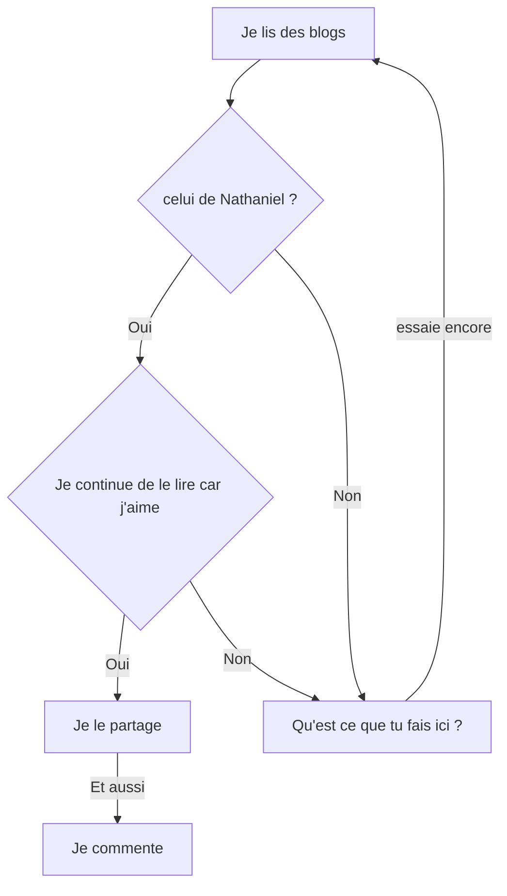
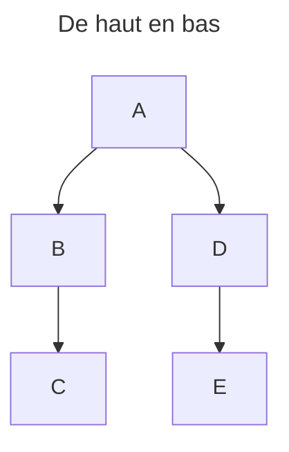
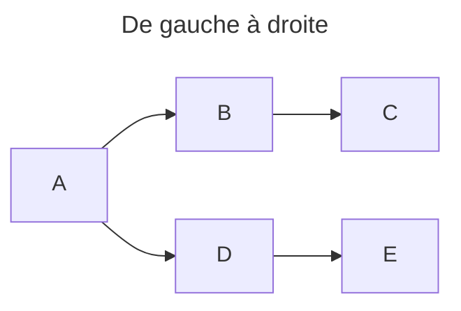
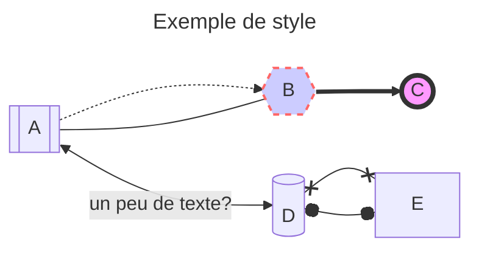
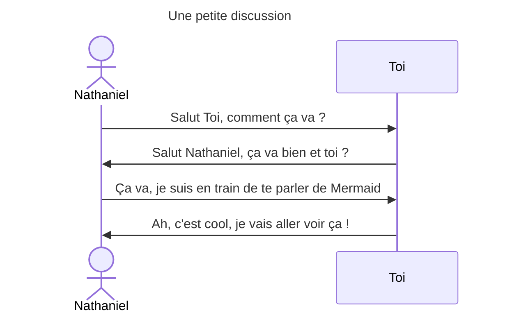
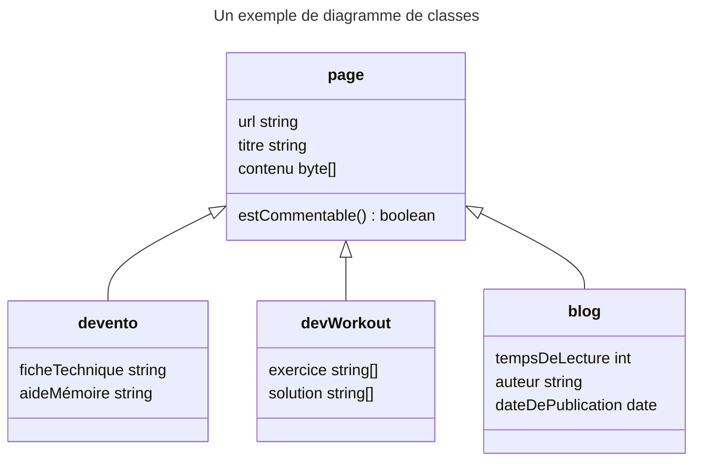
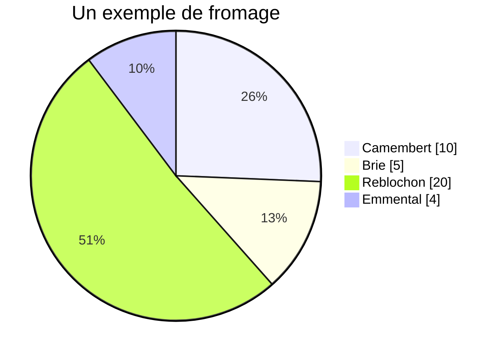
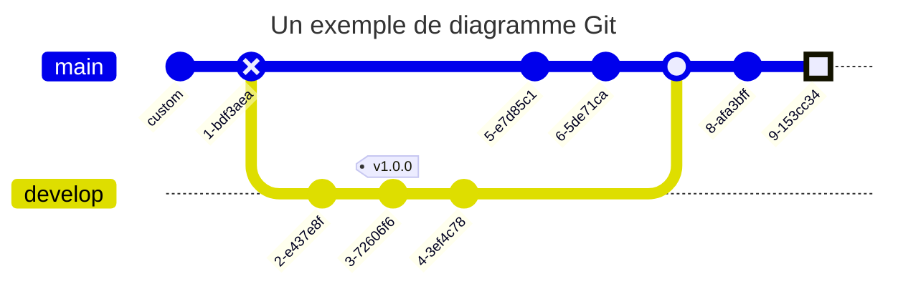

Il n'est pas toujours facile d'imaginer un visuel convaincant pour illustrer sa pensée. Pour ceux qui n'ont aucune notion de graphisme, ou qui ne veulent pas perdre de temps à utiliser un logiciel spécifique, il existe un outil simple à utiliser : [Mermaid](https://mermaid.js.org/).
Avec quelques lignes de textes, il est possible de créer des diagrammes de toutes sortes, intégrables directement dans une page web ou un fichier Markdown.

Voyons ensemble ses avantages et comment tirer parti ses fonctionnalités.

Un sujet un peu plus léger que les précédents, mais tout aussi intéressant. Ne t'inquiète pas, je continuerai à te parler de Spring, mais là, j'ai envie de te parler de [Mermaid](https://mermaid.js.org/).

<!--truncate-->

## Mermaid, des diagrammes faciles à réaliser et à intégrer

Dans mon article précédent sur [Spring](../03/2024-03-01.continue_spring.md), j'ai mis ce "magnifique" [diagramme](../03/2024-03-01.continue_spring.md#le-processus-dune-action-initialisée-par-le-client) que j'ai fait tout seul. Comme j'ai eu d'excellents retours, je me suis dit que j'allais te donner mon secret. J'ai utilisé [Mermaid](https://mermaid.js.org/). Ce superbe diagramme a été créé avec une trentaine de ligne de _texte_. Et c'est tout. 

Mais alors, qu'est-ce que [Mermaid](https://mermaid.js.org/) ? C'est une librairie JavaScript qui te permet de faire des diagrammes, des graphiques, des schémas, des trucs visuels quoi. Et tout ça, directement dans ton Markdown ou dans ta page web.

Un petit exemple pour la route :



Ce diagramme m'a pris 5 minutes à faire. Le plus long ? Trouver l'idée. Il est directement intégré dans mon article, je n'ai pas utilisé de logiciel externe de dessin, il est responsive et pèse 8 lignes. Tu ne me crois pas ? Les voici :

```text
graph TD
    A[Je lis des blogs] --> B{celui de Nathaniel ?}
    B -->|Oui| C{Je continue de le lire car j'aime}
    B -->|Non| X[Qu'est ce que tu fais ici ?]
    X -->|essaie encore| A
    C -->|Oui| D[Je le partage]
    D -->|Et aussi| E[Je commente]
    C -->|Non| X
```

Tu peux aussi le tester dans le [Mermaid live editor](https://mermaid.live/edit#pako:eNpVkM1OwzAQhF9l5Usv7QvkQNUmvSBRhOBQKelhsTeNK_8Ee31ASd4dJwEBe7Jmv1mPZhDSKxKFuAXsO3irGgd5DvUjgdERFEV4N_4Wr7DbPcBxkGSSzjKckTt0mgzsp9V0nJHxOekRyiH7pXesXaKZNvO5kDUMcN-gtvTPdPZuhEv9kjYUGSTBR7ZxghZzBi017K8rfllwihE1ATnpA41wWHfl7__Vkp-gx8B4o29ztQAnBkwxZupULymtJcc_TPknj9gKS8GiVrmgYd43gjuy1IgiPxW1mAw3onFTRjGxf_10UhQcEm1F6hUyVRpztVYULZqYVVKafXhaS1-6n74AYr18iQ). Je t'en reparlerai.

### Mermaid, un outil de création de diagrammes aux multiples fonctionnalités

Comme toujours, si tu veux tout savoir, va lire la [doc officielle](https://mermaid.js.org/intro/). Mais je vais quand même te présenter les bases de Mermaid : 
- Quand j'écris ce blog, Mermaid sait gérer une vingtaine de types de diagrammes différents, dont 3 ou 4 en beta.
- Tu peux créer et tester tes diagrammes en ligne avec le [Mermaid live editor](https://mermaid.live).
- Différents [thèmes](https://mermaid.js.org/config/theming.html) sont disponibles pour personnaliser tes diagrammes. Et tu peux les personnaliser toi-même si tu veux.
- Mermaid se veut [accessible](https://mermaid.js.org/config/accessibility.html).
- Si tu veux, tu peux aussi exporter tes diagrammes en SVG ou PNG grâce à la [Mermaid CLI](https://github.com/mermaid-js/mermaid-cli).
- Je viens de l'apprendre en rédigeant cet article et je trouve ça génial. Tu peux faire des diagrammes [Mathématiques](https://mermaid.js.org/config/math.html) :
  ```mermaid
   graph LR
      A["$$x^2$$"] -->|"$$\sqrt{x+3}$$"| B("$$\frac{1}{2}$$")
      A -->|"$$\overbrace{a+b+c}^{\text{note}}$$"| C("$$\pi r^2$$")
      B --> D("$$x = \begin{cases} a &\text{if } b \\ c &\text{if } d \end{cases}$$")
      C --> E("$$x(t)=c_1\begin{bmatrix}-\cos{t}+\sin{t}\\ 2\cos{t} \end{bmatrix}e^{2t}$$")
  ```
  Au moment où j'écris cet article, cette fonctionnalité n'est pas disponible partout. Par exemple, elle est disponible dans le [live editor](https://mermaid.live/edit#pako:eNpVkctqwzAQRX9lGExJcLKIuzOk0CTdddUuO3WR5XFiiO1UHhcXRf9e-RUarcSZq3NhZFHXGWOMAEejLid4faMKhvP8QRgEXRIFAeEnrNdP1x4QNd9GbBc-un5whd1ixLlR2m6cjQa-vGn-vax_2KQ-xlaFaahdYomEO7FVLewm337yXQowY_nNtetdcBgCHWyBKOVjUVmtGm4cKHiYfEUODlI_JwJ9TzNPucqmN3f6_aB_GfULWW7112auSEslpujcmkjXjRUX-kV4Lm4oiWY82ec4JzaSsQVXWLIpVZH5ddu-k1BOXDJh7K8Z56o9CyFVzkdVK_X7b6UxFtPyCttLpoQPhfLfVGKcq3PD7g83OYz6) ou dans Docusaurus, mais pas encore dans le plugin [JetBrains](https://plugins.jetbrains.com/plugin/20146-mermaid) ni sur [GitHub](https://github.com/Nathaniel-Vaur-Henel/nathaniel-vaur-henel.github.io/wiki/Diagrammes-avec-Mermaid#test-de-diagramme-de-math%C3%A9matiques).

Bien sûr, je n'ai pas tout listé. Prends le temps de lire la [doc officielle](https://mermaid.js.org/intro/) pour en savoir plus.

### Les différentes possibilités d'intégration de Mermaid

#### Dans un fichier Markdown

Si Markdown est pris en charge là où tu veux faire ton diagramme, tu peux
certainement utiliser [Mermaid](https://mermaid.js.org/). Par exemple, il est pris en charge nativement dans [GitLab](https://gitlab.com/) et [GitHub](https://github.com/) dans tous les fichiers `.md`. C'est pratique pour mettre des diagrammes dans ton `README.md` par exemple.

Parfois, il faut installer un plugin, comme dans [Jira](https://www.atlassian.com/software/jira) ou [Docusaurus](https://docusaurus.io/).

Tu trouveras une liste des diverses intégrations sur le [site officiel de Mermaid](https://mermaid.js.org/ecosystem/integrations-community.html). C'est ce que j'ai fait pour mon site, qui utilise [Docusaurus](https://docusaurus.io/).

:::info L'astuce de ton dev sensei

Comme Mermaid est intégré à GitHub et à GitLab. Tu peux créer tes
diagrammes et autres schémas directement dans les différents fichiers markdown de ton repository, le `README.md` par exemple, ou dans le wiki, comme cet [exemple dans un wiki GitHub](https://github.com/Nathaniel-Vaur-Henel/nathaniel-vaur-henel.github.io/wiki/Diagrammes-avec-Mermaid).

:::

Tu trouveras facilement un plugin pour ton IDE préféré. Par exemple, pour [IntelliJ IDEA](https://www.jetbrains.com/idea/), tu as un [plugin Mermaid](https://plugins.jetbrains.com/plugin/20146-mermaid) qui te permet de visualiser les diagrammes Mermaid directement dans ton éditeur.

#### Sur un site web

Tu peux aussi l'utiliser directement dans une page web. Il te suffit d'ajouter le script mermaid et le tour est joué. Voici l'exemple d'implémentation issu du site de Mermaid que tu peux retrouver [ici](https://mermaid.js.org/config/usage.html#simple-full-example) :
```html
<!DOCTYPE html>
<html lang="en">
<body>
<pre class="mermaid">
  graph LR
      A --- B
      B-->C[fa:fa-ban forbidden]
      B-->D(fa:fa-spinner);
    </pre>
<script type="module">
  import mermaid from 'https://cdn.jsdelivr.net/npm/mermaid@10/dist/mermaid.esm.min.mjs';
</script>
</body>
</html>
```

Je l'ai testé en local, ça marche vraiment tout seul !

#### Avec un éditeur en ligne

Et sinon, tu as toujours la solution du [live editor Mermaid](https://mermaid.live/edit), un site web qui te fait le rendu de ton code Mermaid en temps réel. Il contient quelques exemples aussi, qui te permettront de découvrir Mermaid. Ce [live editor](https://mermaid.live/edit) te permet aussi de télécharger ton diagramme, sous divers formats comme le SVG ou le PNG. C'est très pratique pour ajouter un beau diagramme à ta présentation ou à ton document.

## Mermaid, une grande diversité de diagrammes à portée de main

Je vais te présenter quelques types de diagrammes que tu peux faire avec Mermaid. Si tu veux en savoir plus, tu as, comme toujours, la [doc officielle](https://mermaid.js.org/intro/).

### Diagramme de flux

Tu peux choisir le sens de ton diagramme de flux très simplement.



```text title="Le code pour le diagramme de flux 'de haut en bas'"
---
title: De haut en bas
---
graph TD
    A --> B
    B --> C
    A --> D
    D --> E

```




```text title="Le code pour le diagramme de flux 'de gauche à droite'"
---
title: De gauche à droite
---
graph LR
    A --> B
    B --> C
    A --> D
    D --> E
```

Tu peux aussi choisir le style de tes liens, la forme de tes nœuds, et appliquer des styles CSS à tes nœuds et tes liens.



```text title="Le code pour ce diagramme de flux 'Exemple de style'"
---
title: Exemple de style
---
graph LR
  A[[A]] -.-> B{{B}}
  A --- B
  B ==> C((C))
  A <-->|un peu de texte?| D[(D)]
  D x--x E
  D o--o E
    style B fill:#ccf,stroke:#f66,stroke-width:2px,stroke-dasharray: 5, 5
    style C fill:#f9f,stroke:#333,stroke-width:4px
```

### Diagramme de séquence

Tu peux aussi faire des diagrammes de séquence, ce qui est très utile pour expliquer des processus, des interactions, des scénarios. C'est celui que j'ai utilisé dans mon article sur [Spring](../03/2024-03-01.continue_spring.md#le-processus-dune-action-initialisée-par-le-client).



```text title="Le code pour ce diagramme de séquence 'Une petite discussion'"
    participant N as Nathaniel
    participant T as Toi
    N->>T: Salut Toi, comment ça va ?
    T->>N: Salut Nathaniel, ça va bien et toi ?
    N->>T: Ça va, je suis en train de te parler de Mermaid
    T->>N: Ah, c'est cool, je vais aller voir ça !
```

Dans ce type de diagramme, tu peux aussi choisir tes flèches, les styles de tes participants, et plein d'autres choses. Tu peux consulter la [doc sur les Sequence Diagrams](https://mermaid.js.org/syntax/sequenceDiagram.html). 

### Diagramme de Classes

Tu peux aussi faire des diagrammes de classes pour expliquer des structures de données, des relations entre objets, des héritages. 



```text title="Le code pour ce diagramme de classes 'Un exemple de diagramme de classes'"
---
title: Un exemple de diagramme de classes
---
classDiagram
  class page {
    url string
    titre string
    contenu byte[]
    estCommentable() boolean
  }
  class blog {
    tempsDeLecture int
    auteur string
    dateDePublication date
  }
  class devento {
    ficheTechnique string
    aideMémoire string
  }
  class devWorkout {
    exercice string[]
    solution string[]
  }
  page <|-- devento
  page <|-- devWorkout
  page <|-- blog
```

Tu peux utiliser des symboles pour les modificateurs de visibilité, différentes flèches pour les différentes relations, tu peux définir des namespaces, des interfaces, des abstractions, de la cardinalité et bien d'autres choses ! Comme toujours, pour en savoir plus, tu as la [doc sur les Class Diagrams](https://mermaid.js.org/syntax/classDiagram.html).

### Les camemberts

Comment te parler de diagrammes sans te parler de camemberts ? Moi, j'adore ! Tu peux les utiliser pour expliquer des répartitions, des pourcentages, des parts de marché. 



```text title="Le code pour ce diagramme de camembert 'Un exemple de fromage'"
---
title: Un exemple de fromage
---
pie showData
    "Camembert" : 10
    "Brie" : 5
    "Reblochon" : 20
    "Emmental" : 4
```

Tu peux remarquer que [Mermaid](https://mermaid.js.org/) calcule automatiquement les pourcentages. Il n'y a pas grand-chose à savoir sur les camemberts, mais si tu veux en savoir plus, tu as la [doc sur les Pie Charts](https://mermaid.js.org/syntax/pie.html).

### Le diagramme Git

Le diagramme Git est vraiment génial. Tu peux faire des diagrammes de branches Git qui te servent à expliquer des branches, des merges, des rebases. 



```text title="Le code pour ce diagramme de camembert 'Un exemple de diagramme Git'"
---
title: Un exemple de diagramme Git
---
gitGraph
  commit id: "custom"
  commit type: REVERSE
  branch develop
  commit
  commit tag:"v1.0.0"
  commit
  checkout main
  commit
  commit
  merge develop
  commit
  commit type: HIGHLIGHT
```

Comme toujours, je ne te montre qu'un aperçu. Va voir la [doc sur les Git Graphs](https://mermaid.js.org/syntax/gitgraph.html) pour en savoir plus.

Si tu veux voir un schéma plus complexe, tu en trouveras dans la [doc sur les Git Graphs](https://mermaid.js.org/syntax/gitgraph.html#hiding-branch-names-and-lines). Il y en a qui ressemblent plus à une carte de transport en commun qu'à un schéma Git.

## Pour aller plus loin

Voici quelques liens pour approfondir les sujets abordés dans cet article en attendant le prochain article !

- [Mermaid JS](https://mermaid.js.org/)
- Wikipedia :
  - [Diagramme](https://fr.wikipedia.org/wiki/Diagramme)
  - [Mermaid](https://en.wikipedia.org/wiki/Mermaid)

## Conclusion

Pour cet article plus court que les précédents, je t'ai présenté un super outil pour faire des diagrammes et des schémas facilement. Je t'ai expliqué où et comment l'utiliser, et je t'ai montré quelques exemples.

J'espère que tu as appris des choses. Et j'espère que tu as envie d'en apprendre encore plus. Parce que c'est pas fini. Et je te donne rendez-vous dans le prochain article, pour la suite de Spring ? Ou pour un autre sujet ?

Si tu as envie que j'explique plus en avant certains concepts ou que je parle de quelque chose en particulier, n'hésite pas à me le dire dans les commentaires.

Et bon entrainement ! 