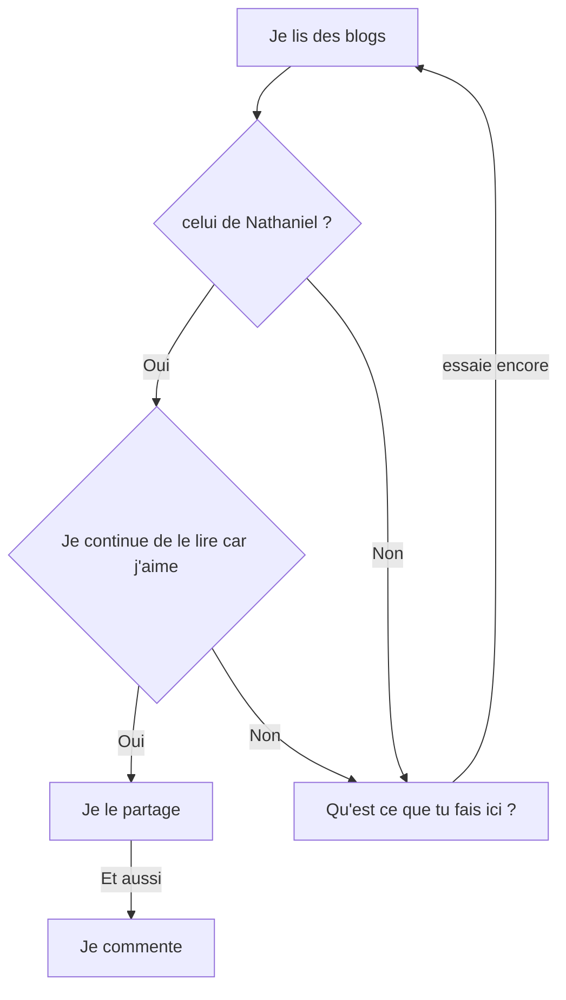
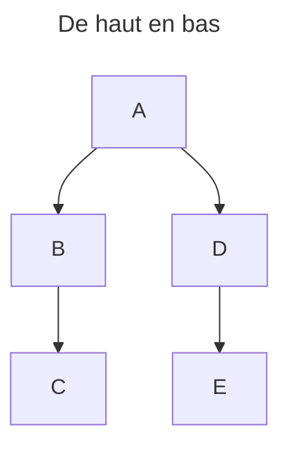
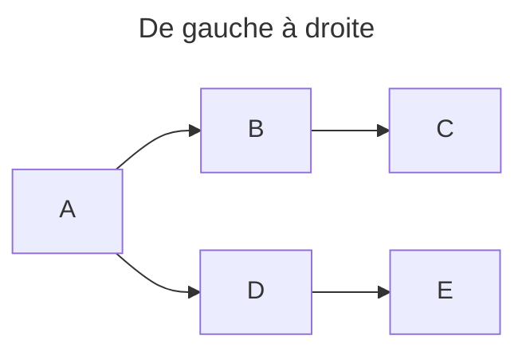
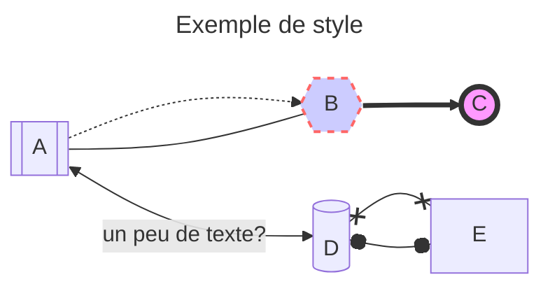
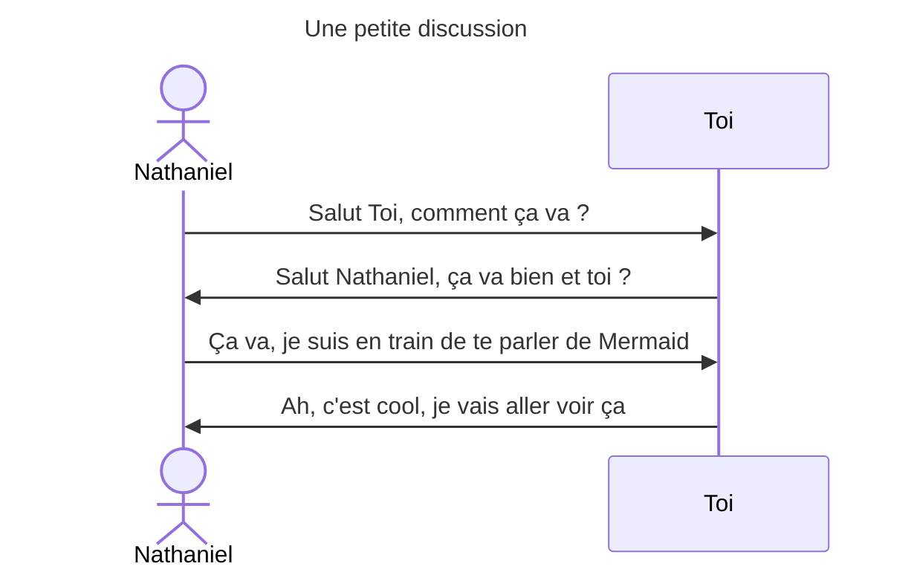
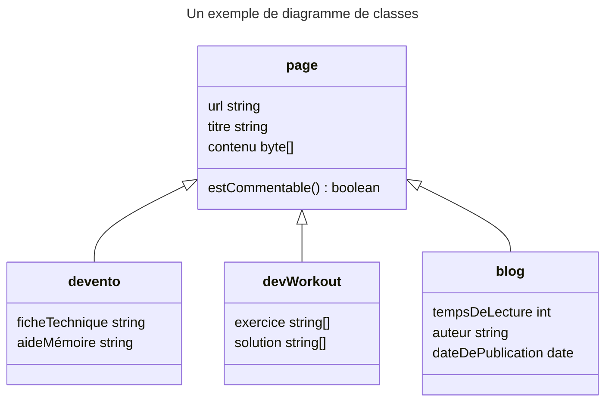
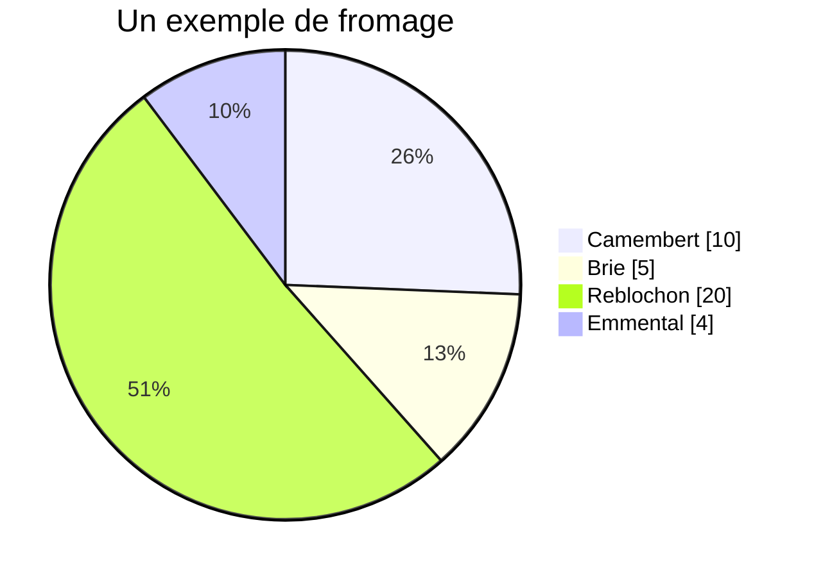
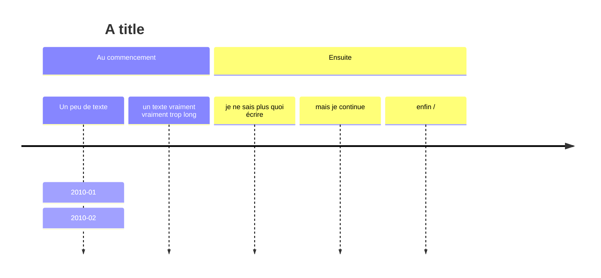

C'est le printemps. Les oiseaux chantent, les fleurs bourgeonnent, et toi, tu es là, à lire cet article. Cela fait 2 mois que je t'en parle du printemps avec Spring, alors là, je vais te parler de l'été avec Mermaid. Mermaid, c'est une librairie qui te permet de faire des schémas, des diagrammes, des graphiques, des trucs visuels quoi. Et tout ça, directement dans ton Markdown ou dans ta page web. 

Un sujet un peu plus léger que les précédents, mais tout aussi intéressant. NE t'inquiète pas, je continuerai à te parler de Spring, mais là, j'avais envie de te parler de Mermaid.


<!--truncate-->

## Mermaid, ou comment faire des diagrammes facilement

Dans mon article précédent sur [Spring](../03/2024-03-01.continue_spring.md), j'ai mis un beau [diagramme](../03/2024-03-01.continue_spring.md#le-processus-dune-action-initialisée-par-le-client) que j'ai fait tout seul. Comme j'ai eu d'excellents retours, je me suis dit que j'allais te donner mon secret. J'ai utilisé Mermaid. Ce beau diagramme a été créé avec une trentaine de ligne. Et c'est tout. 

Mais alors, qu'est-ce que Mermaid ? C'est une librairie JavaScript qui te permet de faire des diagrammes, des graphiques, des schémas, des trucs visuels quoi. Et tout ça, directement dans ton Markdown ou dans ta page web.

Un petit exemple pour la route :


```mermaid
graph TD
    A[Je lis des blogs] --> B{celui de Nathaniel ?}
    B -->|Oui| C{Je continue de le lire car j'aime}
    B -->|Non| X[Qu'est ce que tu fais ici ?]
    X -->|essaie encore| A
    C -->|Oui| D[Je le partage]
    D -->|Et aussi| E[Je commente]
    C -->|Non| X
```

Ce diagramme m'a pris 5 minutes à faire. Il est directement intégré dans mon article, je n'ai pas utilisé de logiciel externe de dessin, il est responsive et pèse 8 lignes. Tu ne me crois pas ? Les voici :

```text
graph TD
    A[Je lis des blogs] --> B{celui de Nathaniel ?}
    B -->|Oui| C{Je continue de le lire car j'aime}
    B -->|Non| X[Qu'est ce que tu fais ici ?]
    X -->|essaie encore| A
    C -->|Oui| D[Je le partage]
    D -->|Et aussi| E[Je commente]
    C -->|Non| X
```

Tu peux aussi le tester dans le [Mermaid live editor](https://mermaid.live/edit#pako:eNpVkM1OwzAQhF9l5Usv7QvkQNUmvSBRhOBQKelhsTeNK_8Ee31ASd4dJwEBe7Jmv1mPZhDSKxKFuAXsO3irGgd5DvUjgdERFEV4N_4Wr7DbPcBxkGSSzjKckTt0mgzsp9V0nJHxOekRyiH7pXesXaKZNvO5kDUMcN-gtvTPdPZuhEv9kjYUGSTBR7ZxghZzBi017K8rfllwihE1ATnpA41wWHfl7__Vkp-gx8B4o29ztQAnBkwxZupULymtJcc_TPknj9gKS8GiVrmgYd43gjuy1IgiPxW1mAw3onFTRjGxf_10UhQcEm1F6hUyVRpztVYULZqYVVKafXhaS1-6n74AYr18iQ).

## Comment utiliser Mermaid ? 

Si Markdown est pris en charge là où tu veux faire ton diagramme, tu peux certainement utiliser Mermaid. Par exemple, il est pris en charge nativement dans [GitLab](https://gitlab.com/) et [GitHub](https://github.com/) ou avec des plugins dans [Jira](https://www.atlassian.com/software/jira) ou [Docusaurus](https://docusaurus.io/).

Tu peux aussi l'utiliser dans une page web. Il te suffit d'ajouter le script Mermaid dans ta page et d'ajouter les balises `<div class="mermaid">` et paf, ça fait des beaux diagrammes. 

## Mermaid sait faire plein de diagrammes

Comme toujours, si tu veux tout savoir, va lire la [doc officielle](https://mermaid.js.org/intro/). Mais je vais quand même te présenter un peu Mermaid : 
- Quand j'écris ce blog, Mermaid sait gérer 19 types de diagrammes différents.
- Tu peux créer et tester tes diagrammes en ligne avec le [Mermaid live editor](https://mermaid.live).
- Différents [thèmes](https://mermaid.js.org/config/theming.html) sont disponibles pour personnaliser tes diagrammes. Et tu peux les personnaliser toi-même si tu veux.
- Mermaid se veut [accessible](https://mermaid.js.org/config/accessibility.html).
- Si tu veux, tu peux aussi exporter tes diagrammes en SVG ou PNG grâce à la [Mermaid CLI](https://github.com/mermaid-js/mermaid-cli).
- Je viens de l'apprendre en rédigeant cet article et je trouve ça génial. Tu peux faire des diagrammes [Mathématiques](https://mermaid.js.org/config/math.html) :
  ```mermaid
   graph LR
      A["$$x^2$$"] -->|"$$\sqrt{x+3}$$"| B("$$\frac{1}{2}$$")
      A -->|"$$\overbrace{a+b+c}^{\text{note}}$$"| C("$$\pi r^2$$")
      B --> D("$$x = \begin{cases} a &\text{if } b \\ c &\text{if } d \end{cases}$$")
      C --> E("$$x(t)=c_1\begin{bmatrix}-\cos{t}+\sin{t}\\ 2\cos{t} \end{bmatrix}e^{2t}$$")
  ```

## Les différents types de diagrammes

Je vais te présenter quelques types de diagrammes que tu peux faire avec Mermaid. Pas tous, car pour ça, tu as la [doc officielle](https://mermaid.js.org/intro/).

### Diagramme de flux

Tu peux choisir le sens de ton diagramme de flux très simplement.


```mermaid
---
title: De haut en bas
---
graph TD
    A --> B
    B --> C
    A --> D
    D --> E
```

```text title="Le code pour le diagramme de flux 'de haut en bas'"
---
title: De haut en bas
---
graph TD
    A --> B
    B --> C
    A --> D
    D --> E

```



```mermaid
---
title: De gauche à droite
---
graph LR
    A --> B
    B --> C
    A --> D
    D --> E
```

```text title="Le code pour le diagramme de flux 'de gauche à droite'"
---
title: De gauche à droite
---
graph LR
    A --> B
    B --> C
    A --> D
    D --> E
```

Tu peux aussi choisir le style de tes liens, la forme de tes nœuds, et appliquer des styles CSS à tes nœuds et tes liens.


```mermaid
---
title: Exemple de style
---
graph LR
  A[[A]] -.-> B{{B}}
  A --- B
  B ==> C((C))
  A <-->|un peu de texte?| D[(D)]
  D x--x E
  D o--o E
    style B fill:#ccf,stroke:#f66,stroke-width:2px,stroke-dasharray: 5, 5
    style C fill:#f9f,stroke:#333,stroke-width:4px
```

```text title="Le code pour ce diagramme de flux 'Exemple de style'"
---
title: Exemple de style
---
graph LR
  A[[A]] -.-> B{{B}}
  A --- B
  B ==> C((C))
  A <-->|un peu de texte?| D[(D)]
  D x--x E
  D o--o E
    style B fill:#ccf,stroke:#f66,stroke-width:2px,stroke-dasharray: 5, 5
    style C fill:#f9f,stroke:#333,stroke-width:4px
```

Tu peux vraiment faire plein de choses avec ce diagramme. Et je ne vais pas te réécrire la doc de Mermaid ici, ça n'aurait pas de sens. Tu as la [doc sur les Flowcharts](https://mermaid.js.org/syntax/flowchart.html) pour ça.

### Diagramme de séquence

Tu peux aussi faire des diagrammes de séquence. C'est très utile pour expliquer des processus, des interactions, des scénarios. C'est celui que j'ai utilisé dans mon article sur [Spring](../03/2024-03-01.continue_spring.md#le-processus-dune-action-initialisée-par-le-client).


```mermaid
---
title: Une petite discussion
---
sequenceDiagram
    actor N as Nathaniel
    participant T as Toi
    N->>T: Salut Toi, comment ça va ?
    T->>N: Salut Nathaniel, ça va bien et toi ?
    N->>T: Ça va, je suis en train de te parler de Mermaid
    T->>N: Ah, c'est cool, je vais aller voir ça
```

```text title="Le code pour ce diagramme de séquence 'Une petite discussion'"
    participant N as Nathaniel
    participant T as Toi
    N->>T: Salut Toi, comment ça va ?
    T->>N: Salut Nathaniel, ça va bien et toi ?
    N->>T: Ça va, je suis en train de te parler de Mermaid
    T->>N: Ah, c'est cool, je vais aller voir ça
```

Dans ce type de diagramme, tu peux aussi choisir tes flèches, les styles de tes participants, et plein d'autres choses. Tu as la [doc sur les Sequence Diagrams](https://mermaid.js.org/syntax/sequenceDiagram.html) pour ça. 

### Diagramme de Classes

Tu peux aussi faire des diagrammes de classes. C'est très utile pour expliquer des structures de données, des relations entre objets, des héritages. 


```mermaid
---
title: Un exemple de diagramme de classes
---
classDiagram
  class page {
    url string
    titre string
    contenu byte[]
    estCommentable() boolean
  }
  class blog {
    tempsDeLecture int
    auteur string
    dateDePublication date
  }
  class devento {
    ficheTechnique string
    aideMémoire string
  }
  class devWorkout {
    exercice string[]
    solution string[]
  }
  page <|-- devento
  page <|-- devWorkout
  page <|-- blog
```

```text title="Le code pour ce diagramme de classes 'Un exemple de diagramme de classes'"
---
title: Un exemple de diagramme de classes
---
classDiagram
  class page {
    url string
    titre string
    contenu byte[]
    estCommentable() boolean
  }
  class blog {
    tempsDeLecture int
    auteur string
    dateDePublication date
  }
  class devento {
    ficheTechnique string
    aideMémoire string
  }
  class devWorkout {
    exercice string[]
    solution string[]
  }
  page <|-- devento
  page <|-- devWorkout
  page <|-- blog
```

Tu peux utiliser des symboles pour les modificateurs de visibilité, différentes flèches pour les différentes relations, tu peux définir des namespaces, des interfaces, des abstractions, de la cardinalité et bien d'autres choses ! Comme toujours, pour en savoir plus, tu as la [doc sur les Class Diagrams](https://mermaid.js.org/syntax/classDiagram.html).

### Les camemberts

Comment te parler de diagrammes sans te parler de camemberts ? Moi, j'adore ça les camemberts ! C'est très utile pour expliquer des répartitions, des pourcentages, des parts de marché. 


```mermaid
---
title: Un exemple de fromage
---
pie showData
    "Camembert" : 10
    "Brie" : 5
    "Reblochon" : 20
    "Emmental" : 4
```

```text title="Le code pour ce diagramme de camembert 'Un exemple de fromage'"
---
title: Un exemple de fromage
---
pie showData
    "Camembert" : 10
    "Brie" : 5
    "Reblochon" : 20
    "Emmental" : 4
```

Tu peux remarquer que Mermaid te calcule automatiquement les pourcentages. Il n'y a pas grand-chose à savoir sur les camemberts, mais si tu veux en savoir plus, tu as la [doc sur les Pie Charts](https://mermaid.js.org/syntax/pie.html).

### La frise chronologique

Tu peux aussi faire des frises chronologiques. C'est très utile pour expliquer des événements, des dates, des périodes. 


```mermaid
---
title: Un exemple de frise chronologique
---
timeline
  title A title
  section Au commencement
    Un peu de texte: 2010-01
            : 2010-02
    un texte vraiment vraiment trop long
  section Ensuite
    je ne sais plus quoi écrire
    mais je continue
    enfin /
```


:::info Le moment mnémotechnique

> Ceci est un encart pour te donner un moyen mnémotechnique.

:::

:::warning Attention aux Chocabugs !

> Explication d'un truc pas cool qui fait des bugs.

Et paf, ça fait des Chocabugs©.

:::

:::info L'astuce de ton dev sensei

> Explication d'un truc cool qui fait des trucs cool.

:::


## Partie 1

### Sous Partie 1.1

### Sous Partie 1.2

## Partie 2

### Sous Partie 2.1

### Sous Partie 2.2

## Pour aller plus loin

Voici quelques liens pour approfondir les sujets abordés dans cet article en attendant le prochain article !

- Wikipedia :
  - > mettre des liens 
- Les sites officiels :
  - > mettre des liens 

## Conclusion

> Résumer les parties, une phrase par partie.

J'espère que tu as appris des choses. Et j'espère que tu as envie d'en apprendre encore plus. Parce que c'est pas fini. Et je te donne rendez-vous dans le prochain article pour `teaser le prochain article`.

Si tu as envie que j'explique plus en avant certains concepts ou que je parle de quelque chose en particulier, n'hésite pas à me le dire dans les commentaires.

Et bon entrainement ! 