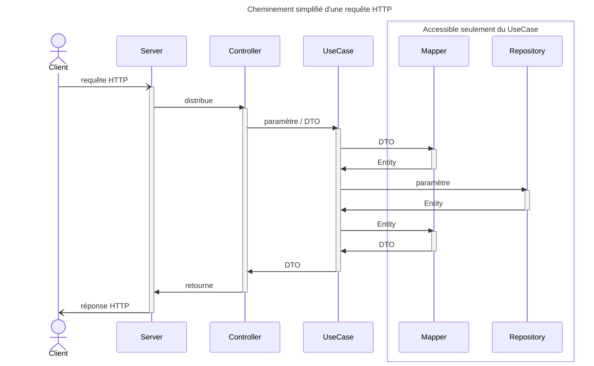

Que l'on soit un développeur Java débutant ou non, il est nécessaire de consulter un tutoriel complet avant de lancer son premier projet Spring. En effet, ce framework peut être difficile à prendre en main. Une bonne technique d'approche est nécessaire pour ne pas se perdre dans son apprentissage. La plupart des tutoriels que j'ai vus jusqu'ici m'ont semblé trop compliqués pour être utilisés sur un premier projet. Cet article propose de créer un projet Spring simple qui permet d'assimiler les bases sans s'encombrer de la complexité du framework.

<!--truncate-->

## Concevoir un premier projet Spring avec Spring Initializr

Dans [l'article précédent](/blog/2024/2024-02-15.begin_spring.md), je t'ai expliqué comment créer un projet Spring avec Spring Initializr. Il s'agit selon moi du moyen le plus efficace de se lancer avec Spring. Cet article étant la suite directe, je t'en recommande la lecture si ce n'est déjà fait.

Le but maintenant est de se familiariser avec les annotations de base de Spring. Pour ce faire, je te propose de créer sur un petit sac fourre-tout afin de te familiariser avec les fonctionnalités de base.
Reprends le projet créé pour l'article précédent, et complétons-le ensemble.

:::warning

Comme précédemment, je vais considérer que tu as déjà des bases en Java. Si ce n'est pas le cas, je te conseille de commencer par là. Tu trouveras plein de ressources sur le net pour apprendre Java. J'ai toujours aimé les cours d'[OpenClassrooms](https://openclassrooms.com/fr/courses/6173501-apprenez-a-programmer-en-java), mais il y en a plein d'autres. Et tu pourras trouver quelques conseils sur ce site.

:::

Nous allons créer un sac ~~de grain de café~~ fourre-tout. Le but : faire une liste d'objets (ou de ce qu'on veut, c'est un sac super magique).  
Nous allons donc créer de quoi :

1. Ajouter des choses.
2. Lister les choses.
3. Lire une chose.
4. Modifier une chose.
5. Supprimer une chose.

Et c'est déjà pas mal.

:::warning

Il y a plusieurs techniques, plusieurs écoles, plusieurs manières de faire. Je vais t'en montrer une. Elle est simple et efficace, mais tu pourras trouver d'autres manières de faire. Le but, c'est de te montrer les bases, et après, tu pourras faire comme tu veux. Ou comme tu dois.

:::

:::note

Je ferai certainement des [Devento](/devento) pour expliquer tout ce que je vais te présenter, mais pour l'instant, je te conseille de lire les liens que je t'ai mis. Et tu peux aussi faire des recherches dans ton moteur de recherche préféré. Et sur les sites de référence que j'ai mis dans le pied de page du site !

:::

### L'application

Nous allons faire une application serveur en [REST](https://fr.wikipedia.org/wiki/Representational_state_transfer) : nous allons définir des [endpoints](https://en.wikipedia.org/wiki/Endpoint_interface) pour faire des actions sur notre sac.

Les [verbes, ou méthodes, HTTP](https://fr.wikipedia.org/wiki/Hypertext_Transfer_Protocol#M%C3%A9thodes) que nous allons utiliser sont :

- `GET` pour lire des données.
- `POST` pour créer des données.
- `PUT` pour modifier des données.
- `DELETE` pour supprimer des données.

### L'architecture

Nous allons partir sur une architecture très simple et très découpée d'application server. Voici les types de classes que nous allons créer :

- Une `Entity`, qui représente un objet en bases de données.
- Un `Repository`, qui permet de manipuler ces entités.
- Des `UseCase`, qui permettent de faire des actions sur ces entités. Tu as un `UseCase` par action.
- Un `Controller`, qui permet de faire le lien entre l'application et l'extérieur.
- Un `DTO`, un [Data Transfer Object](https://fr.wikipedia.org/wiki/Objet_de_transfert_de_donn%C3%A9es), qui est l'objet que s'échangeront notre serveur et ses clients.
- Un `Mapper`, qui permet de faire le lien entre les entités et les DTO.

Une classe, un rôle. C'est simple, c'est efficace, c'est facile à comprendre. Et c'est le but et le leitmotiv de tout l'article.

### Le processus d'une action initialisée par le client

Dans notre application, nos composants vont intéragir entre eux. Comme dit précédemment, le mieux, c'est que chacun aie sa propre responsabilité.  
Voici un résumé de qui fait quoi dans notre application :

- Le `Client` envoie une requête HTTP au `Serveur`.
- Le `Serveur` distribue la requête [désérialisée](https://fr.wikipedia.org/wiki/S%C3%A9rialisation) au `Controller` en validant les paramètres. Si besoin, c'est à ce moment, là que le `DTO` apparait sous forme de paramètre de requête.
- Le `Controller` demande au `UseCase` d'effectuer la tâche, en lui passant les paramètres dont il aura besoin.
- Le `UseCase` effectue la tâche. C'est là que se trouve tout le métier. C'est lui qui fait appel aux autres composants.
  - S'il a besoin de transformer un `DTO` en `Entity` ou inversement, il appelle un `Mapper`.
  - S'il a besoin d'un accès à la base de donnée, il appelle un `Repository`.
  - S'il a besoin d'un autre composant, il l'appelle directement.
- Le `UseCase` retourne un `DTO` ou une valeur au `Controller`.
- Le `Controller` retourne une réponse HTTP au `Serveur` sous forme d'objet Java.
- Le `Serveur` [serialise](https://fr.wikipedia.org/wiki/S%C3%A9rialisation) l'objet java en requête HTTP qu'il retourne au `Client`.



Pour résumer, dans un `GET`:

- Le `Client` est le composant qui envoie les requêtes HTTP au `Server` et qui reçoit les réponses HTTP du `Server`. Cela peut être une interface graphique, une autre application, un script, etc.
- Le `Server` est le composant qui reçoit les requêtes HTTP du `Client` et qui retourne les réponses HTTP au `Client`. Dans notre cas, c'est un serveur Web Spring Boot.
- Le `Controller` est le point d'entrée de l'application. Il reçoit les requêtes HTTP et retourne les réponses HTTP. Il ne sait gérer que ça !
- Le `UseCase` est le cœur de l'application. Il ne sait pas gérer les requêtes HTTP. Il ne sait pas non plus gérer les accès à la base de donnée. Il ne sait que gérer le métier et demander aux autres composants de faire ce qu'ils savent faire.
- Le `Mapper` est un composant qui transforme un `DTO` en `Entity` ou inversement.
- Le `Repository` est un composant qui gère les accès à la base de donnée.
- Le `DTO` est un objet qui représente une requête HTTP ou une réponse HTTP. Il est utilisé pour communiquer entre le `Controller` et le `UseCase`.
- L'`Entity` est un objet qui représente une ligne de la base de donnée. Il est utilisé pour communiquer entre le `UseCase` et le `Repository`.

:::note

Dans notre cas, c'est Spring qui va s'occuper de la [désérialisation et de la sérialisation](https: //fr.wikipedia.org/wiki/S%C3%A9rialisation) des objets Java en requête HTTP. Tout seul, grâce à la magie des annotations. Et grâce à une library qui s'appelle [Jackson](https://github.com/FasterXML/jackson)

:::

### Les dépendances

Nous allons utiliser les dépendances que nous avons ajoutées dans le projet de l'article [Débuter avec Spring grâce à Spring Initializr](2024-02-15.begin_spring.md#avant-de-commencer-présentation-des-dépendances).

Rien de plus.

## Écrivons notre projet Spring !

> On va Springer© !

Commençons par le début. Ou la fin, tout dépend du point de vue. Nous, nous allons faire les choses dans l'ordre que je t'ai donné [plus haut](#larchitecture).

:::note

J'aime écrire mon code tout en anglais. Comme tout, c'est une question d'habitude et de choix personnel ou d'équipe. Par contre, je vais t'écrire toute la doc en français pour plus de simplicité.

Pour faire simple, je vais tout mettre dans le même package même si ce n'est pas recommandé. Je traiterai plus tard les histoires de Clean architecture, d'architecture hexagonale ou autres. Il n'est pas nécessaire de connaître ces points pour avancer. D'autres articles ? Des [Devento](/devento) ? On verra...

:::

:::info L'astuce de ton dev sensei

Ne copie colle pas le code. Jamais. Enfin, pas tout de suite. Lis-le, comprends-le, et, pour ça, écris-le. L'apprentissage passe par là. Si tu lis cet article, tu as besoin de pratiquer. Alors commence maintenant. Tiens, je devrais écrire un article sur la pratique, le copier-coller, et tout ça...

:::

### Écrivons l'Entity

C'est l'objet, au sens [POO](https://fr.wikipedia.org/wiki/Programmation_orient%C3%A9e_objet), que nous allons manipuler en base de donnée. C'est un simple objet, avec des attributs, des getters et des setters. C'est tout. C'est une classe Java, rien de plus.

Il ne sera manipuler que par nos Use Cases et par notre repository. Le Controller n'en aura jamais connaissance. Cela permet de désolidariser ton IHM de ta BDD.

```java title="SomethingEntity.java"
package fr.nvh.begin.spring.bag;

import jakarta.persistence.Entity;
import jakarta.persistence.GeneratedValue;
import jakarta.persistence.GenerationType;
import jakarta.persistence.Id;
import lombok.Getter;
import lombok.Setter;
import lombok.ToString;

@Entity // indique que cette classe est une entité JPA, c'est obligatoire pour que JPA puisse la gérer
@Getter // Lombok : génère automatiquement les getters
@Setter // Lombok : génère automatiquement les setters
@ToString // Lombok : génère automatiquement la méthode toString()
public class SomethingEntity {

    @Id // indique à Hibernate que ce champ est la clé primaire qui identifie de manière unique chaque ligne en base, là encore c'est obligatoire
    @GeneratedValue(strategy = GenerationType.IDENTITY) // indique que c'est le SGBD qui s'occupe de générer les identifiants
    private Long id;
    private String name; // le nom de la chose
    private String description; // la description de la chose

}
```

Voilà, j'avais dit que j'allais faire simple.

Bon, et si nous faisions un peu de base de données ?

### Écrivons le Repository

Le repository est la classe qui va permettre de manipuler les entités. C'est une interface qui va être implémentée par Spring Data JPA. C'est une interface, tout simplement. Spring se chargera de l'implémenter pour toi. Pas juste de l'instancier, Spring va te l'implémenter. Magique !

Et quand je dis "tout simplement" :

```java title="SomethingRepository.java"
package fr.nvh.begin.spring.bag;

import org.springframework.data.jpa.repository.JpaRepository;
import org.springframework.stereotype.Repository;

@Repository // indique que cette interface est un bean Spring de type Repository
public interface SomethingRepository extends JpaRepository<SomethingEntity, Long> {
}
```

Et voilà. C'est une interface qui étend une autre interface. Tu n'as rien de plus à faire. Spring va te générer tout le code pour toi grâce à l'interface `JpaRepository`. Je t'avais dit que Spring était magique !

Le `@Repository` est une annotation Spring qui indique que cette interface est un bean Spring de type Repository. Et hop, notre premier grain de café dans le sac.

:::note

Spring est même encore plus magique. Tu peux créer des méthodes en respectant une [certaine nomenclature](https://docs.spring.io/spring-data/jpa/reference/jpa/query-methods.html), et Spring va générer les requêtes SQL pour toi. Ce n'est même de la magie à ce niveau-là, c'est un miracle. Je t'en parlerai un autre jour. Ou dans un [Devento](/devento).

Il existe plusieurs types de repository qui contient des méthodes prédéfinies. Là, j'ai pris `JpaRepository`, le plus complet et le plus simple à utiliser.

:::

Allez, nous allons quand même tester tout ça. Est-ce que tu te souviens de [H2 Database](https://www.h2database.com/html/main.html) ? C'est le moment de le faire fonctionner.

### Testons notre entité et son repository

Rien de plus important qu'un feedback régulier. Je te conseille d'avancer pas à pas et de tester à chaque étape. Comme les tests unitaires ne sont pas le sujet de cet article, je vais te montrer une astuce : le context Spring.

Va dans ta classe principale, celle qui a le `@SpringBootApplication`, modifie la comme ceci :

```java title="DebuteAvecSpringApplication.java"
package fr.nvh.begin.spring;

import fr.nvh.begin.spring.bag.SomethingEntity;
import fr.nvh.begin.spring.bag.SomethingRepository;
import org.springframework.boot.SpringApplication;
import org.springframework.boot.autoconfigure.SpringBootApplication;
import org.springframework.context.ConfigurableApplicationContext;


@SpringBootApplication
public class DebuteAvecSpringApplication {

    public static void main(String[] args) {
        ConfigurableApplicationContext context = SpringApplication.run(DebuteAvecSpringApplication.class, args);
        SomethingRepository repository = context.getBean(SomethingRepository.class);

        // Création d'une instance de SomethingEntity
        SomethingEntity myFirstThing = new SomethingEntity();
        myFirstThing.setName("My first thing");
        myFirstThing.setDescription("This is my first thing");
        // Affichage dans la console pour voir ce qu'elle contient
        System.out.println("not saved thing = " + myFirstThing);

        // Sauvegarde en base de données
        SomethingEntity save = repository.save(myFirstThing);
        // Affichage à nouveau dans la console pour voir ce qu'elle contient
        System.out.println("saved thing = " + myFirstThing);

        // Récupération de la chose de la base de données pour vérifier qu'elle a bien été sauvegardée
        repository.findById(save.getId()).ifPresent(thing -> System.out.println("read thing = " + thing));

        // Affichage de toutes les choses en base de données
        System.out.println("All things : ");
        repository.findAll().forEach(thing -> System.out.println(" - " + thing));
    }
}
```

Dans la console, après les logs Spring, tu vas voir apparaître nos `System.out.println` :

```text
not saved thing = SomethingEntity(id=null, name=My first thing, description=This is my first thing)
saved thing = SomethingEntity(id=1, name=My first thing, description=This is my first thing)
read thing = SomethingEntity(id=1, name=My first thing, description=This is my first thing)
All things : 
 - SomethingEntity(id=1, name=My first thing, description=This is my first thing)
```

Tu as créé une entité, tu l'as sauvegardée, tu l'as lue, et tu as affiché toutes les entités. C'est tout. C'est magique. C'est Spring.

:::note

Avant la sauvegarde, l'entité n'avait pas d'identifiant. Après la sauvegarde, elle en a un. C'est Spring et Hibernate qui s'en sont occupé. Magique, encore et toujours !

:::

:::warning

N'utilise jamais `System.out.println` en projet. C'est juste pour te montrer que ça marche et nous simplifier les logs ! En projet, même perso, tu utiliseras un vrai logger. J'y reviendrai dans un autre article. Encore.

:::

Tu veux vérifier ta base de données ? Lance ton serveur et va sur [http://localhost:8080/h2-console](http://localhost:8080/h2-console). Connecte-toi en utilisant les paramètres indiqués dans tes logs. Tu trouveras toutes les infos dans mon article précédent, dans la partie [Lancement de l'application du projet généré](http://localhost:3000/blog/begin-spring#lancement-de-lapplication-du-projet-g%C3%A9n%C3%A9r%C3%A9), sous partie des logs.
*Abracadabra !* Tu devrais voir ta table `SOMETHING_ENTITY` et les données que tu as insérées.

:::info L'astuce de ton dev sensei

La JDBC URL change à chaque démarrage de l'application. Tu peux la trouver dans les logs de ton application. Tu peux aussi la changer dans le fichier `application.properties` de ton projet. Ajoute la ligne `spring.datasource.url=jdbc:h2:mem:mydb` pour avoir toujours la même URL.

:::

### Écrivons le DTO

Le DTO est la classe qui va permettre de faire le lien entre l'entité et le controller. C'est un simple objet, avec des attributs, des getters et des setters. C'est tout. Il s'agit d'une classe Java, rien de plus. Comme l'entité, mais sans les annotations JPA.

```java title="SomethingDto.java"
package fr.nvh.begin.spring.bag;

import lombok.Getter;
import lombok.Setter;
import lombok.ToString;

@Getter // Lombok : génère automatiquement les getters
@Setter // Lombok : génère automatiquement les setters
@ToString // Lombok : génère automatiquement la méthode toString
public class SomethingDto {

    private Long id;
    private String name;
    private String description;

}
```

### Écrivons le Mapper

Le mapper est la classe qui va permettre de faire le lien entre l'entité et le DTO. C'est une classe, avec des méthodes, qui vont permettre de convertir une entité en DTO et un DTO en entité. Du coup, nous allons créer deux méthodes, une pour chaque sens.

```java title="SomethingMapper.java"
package fr.nvh.begin.spring.bag;

import org.springframework.stereotype.Component;

@Component // indique que cette classe est un bean Spring de type Component
public class SomethingMapper {

    public SomethingDto toDto(SomethingEntity entity) {
        if (entity == null) {
            return null;
        }
        SomethingDto dto = new SomethingDto();
        dto.setId(entity.getId());
        dto.setName(entity.getName());
        dto.setDescription(entity.getDescription());
        return dto;
    }

    public SomethingEntity toEntity(SomethingDto dto) {
        if (dto == null) {
            return null;
        }
        SomethingEntity entity = new SomethingEntity();
        entity.setId(dto.getId());
        entity.setName(dto.getName());
        entity.setDescription(dto.getDescription());
        return entity;
    }
}
```

Cette classe est un `@Component`, c'est-à-dire un bean Spring. Un autre grain de café dans le sac de Spring.

:::info

Tu as des librairies qui te permettent de fare des mappers à grands coups... d'annotations ! Par exemple, [MapStruct](https://mapstruct.org/). Mais je te conseille de commencer par faire tes mappers à la main. C'est plus simple, et ça te permet de comprendre ce que tu fais. Tu pourras toujours utiliser MapStruct plus tard.

:::

Allez, testons ce mapper ! Reprends la classe `DebuteAvecSpringApplication` et modifie-la comme ceci :

```java title="DebuteAvecSpringApplication.java"
package fr.nvh.begin.spring;

import fr.nvh.begin.spring.bag.SomethingDto;
import fr.nvh.begin.spring.bag.SomethingEntity;
import fr.nvh.begin.spring.bag.SomethingMapper;
import fr.nvh.begin.spring.bag.SomethingRepository;
import org.springframework.boot.SpringApplication;
import org.springframework.boot.autoconfigure.SpringBootApplication;
import org.springframework.context.ConfigurableApplicationContext;


@SpringBootApplication
public class DebuteAvecSpringApplication {

    public static void main(String[] args) {
        ConfigurableApplicationContext context = SpringApplication.run(DebuteAvecSpringApplication.class, args);
        testRepository(context);
        testMapper(context);
    }

    private static void testMapper(ConfigurableApplicationContext context) {
        System.out.println("*** Test du mapper ***");
        SomethingEntity entity = new SomethingEntity();
        entity.setId(1L); // on met un id pour voir si le mapper le prend en compte
        entity.setName("Another thing");
        entity.setDescription("This is another thing");

        System.out.println("not mapped entity = " + entity);

        SomethingMapper mapper = context.getBean(SomethingMapper.class);
        SomethingDto dto = mapper.toDto(entity);
        System.out.println("mapped DTO = " + dto);

        SomethingEntity mappedEntity = mapper.toEntity(dto);
        System.out.println("mappedEntity = " + mappedEntity);

        // on teste aussi les cas limites
        System.out.println("toDto(null) = " + mapper.toDto(null));
        System.out.println("toEntity(null) = " + mapper.toEntity(null));
    }

    private static void testRepository(ConfigurableApplicationContext context) {
        System.out.println("*** Test du repository ***");
        SomethingRepository repository = context.getBean(SomethingRepository.class);

        // Création d'une instance de SomethingEntity
        SomethingEntity myFirstThing = new SomethingEntity();
        myFirstThing.setName("My first thing");
        myFirstThing.setDescription("This is my first thing");
        // on l'affiche dans la console pour voir ce qu'elle contient
        System.out.println("not saved thing = " + myFirstThing);

        // on la sauvegarde en base de données
        SomethingEntity save = repository.save(myFirstThing);
        // on l'affiche à nouveau dans la console pour voir ce qu'elle contient
        System.out.println("saved thing = " + myFirstThing);

        // on la récupère de la base de données pour vérifier qu'elle a bien été sauvegardée
        repository.findById(save.getId()).ifPresent(thing -> System.out.println("read thing = " + thing));

        // on affiche toutes les choses en base de données
        System.out.println("All things : ");
        repository.findAll().forEach(thing -> System.out.println(" - " + thing));
    }
}
```

Oui, j'ai réécrit le code. Ce sera plus simple à lire. Il est recommandé de faire des petites méthodes qui font une seule chose. Je pourrais faire un article là-dessus...

Alors, maintenant, lance ton application. Tu devrais voir apparaître dans la console :

```text
*** Test du repository ***
not saved thing = SomethingEntity(id=null, name=My first thing, description=This is my first thing)
saved thing = SomethingEntity(id=1, name=My first thing, description=This is my first thing)
read thing = SomethingEntity(id=1, name=My first thing, description=This is my first thing)
All things : 
 - SomethingEntity(id=1, name=My first thing, description=This is my first thing)
*** Test du mapper ***
not mapped entity = SomethingEntity(id=1, name=Another thing, description=This is another thing)
mapped DTO = SomethingDto(id=1, name=Another thing, description=This is another thing)
mappedEntity = SomethingEntity(id=1, name=Another thing, description=This is another thing)
toDto(null) = null
toEntity(null) = null
```

La première partie `*** Test du repository ***` est déjà connue, je l'ai juste mise en forme afin qu'on la voie bien dans les logs. La deuxième partie `*** Test du mapper ***` est nouvelle. Tu as créé une entité, tu l'as transformée en DTO, tu as transformé ce DTO en entité, et tu as testé les cas limites. Quand tu testes, tu testes tout : les cas normaux, les cas limites, les cas d'erreurs. Tu sais quoi ? Je t'en parlerai dans un autre article. Ou dans un [Devento](/devento).

### Écrivons le Controller

Comme je te l'ai dit, le controller va nous permettre de faire le lien entre l'application et l'extérieur. Tu déclares des méthodes avec des tas d'annotations, et Spring va s'occuper de tout. C'est magique.

:::info L'astuce de ton dev sensei

Je te conseille de faire un endpoint après l'autre. C'est plus simple pour tester et pour comprendre. Et du coup, un use case après l'autre. Et n'oublie d'écrire le code que je te présente, ne le copie-colle pas si tu veux commencer à le retenir.

::: 

```java title="SomethingController.java"
package fr.nvh.begin.spring.bag;

import fr.nvh.begin.spring.bag.use.cases.SomethingCreateUseCase;
import fr.nvh.begin.spring.bag.use.cases.SomethingDeleteUseCase;
import fr.nvh.begin.spring.bag.use.cases.SomethingFindAllUseCase;
import fr.nvh.begin.spring.bag.use.cases.SomethingFindByIdUseCase;
import fr.nvh.begin.spring.bag.use.cases.SomethingUpdateUseCase;
import lombok.RequiredArgsConstructor;
import lombok.extern.slf4j.Slf4j;
import org.springframework.http.HttpStatus;
import org.springframework.web.bind.annotation.DeleteMapping;
import org.springframework.web.bind.annotation.GetMapping;
import org.springframework.web.bind.annotation.PathVariable;
import org.springframework.web.bind.annotation.PostMapping;
import org.springframework.web.bind.annotation.PutMapping;
import org.springframework.web.bind.annotation.RequestBody;
import org.springframework.web.bind.annotation.RequestMapping;
import org.springframework.web.bind.annotation.ResponseStatus;
import org.springframework.web.bind.annotation.RestController;

import java.util.List;

@Slf4j // Lombok : génère automatiquement un logger
@RequiredArgsConstructor
// Lombok : génère automatiquement un constructeur avec tous les champs en paramètres. Cela permet d'injecter les dépendances dans le contrôleur.
@RestController // indique que cette classe est un bean Spring de type Controller
@RequestMapping("/api/something")
// indique que toutes les méthodes de cette classe sont accessibles via l'URL /api/something
public class SomethingController {
    // tous les use cases dont nous avons besoin, un par action
    private final SomethingCreateUseCase somethingCreateUseCase;
    private final SomethingFindAllUseCase somethingFindAllUseCase;
    private final SomethingFindByIdUseCase somethingFindByIdUseCase;
    private final SomethingUpdateUseCase somethingUpdateUseCase;
    private final SomethingDeleteUseCase somethingDeleteUseCase;
  
    @ResponseStatus(HttpStatus.CREATED)
    @PostMapping
    public SomethingDto create(@RequestBody SomethingDto somethingDto) { // le paramètre somethingDto est récupéré dans le corps de la requête
        log.info("POST /api/something {}", somethingDto);
        return somethingCreateUseCase.create(somethingDto);
    }
  
    @ResponseStatus(HttpStatus.OK) // indique que la méthode retourne un code HTTP 200
    @GetMapping // indique que cette méthode est accessible via une requête HTTP GET
    public List<SomethingDto> findAll() {
        log.info("GET /api/something"); // log pour voir ce qui se passe dans la console
        return somethingFindAllUseCase.findAll(); // appel du use case
    }
  
    @ResponseStatus(HttpStatus.OK)
    @GetMapping("/{id}")
    public SomethingDto findById(@PathVariable Long id) { // le paramètre id est récupéré dans l'URL
        log.info("GET /api/something/{}", id);
        return somethingFindByIdUseCase.findById(id);
    }
  
    @ResponseStatus(HttpStatus.OK)
    @PutMapping("/{id}")
    public SomethingDto update(@PathVariable Long id, @RequestBody SomethingDto somethingDto) {
        log.info("PUT /api/something/{} {}", id, somethingDto);
        return somethingUpdateUseCase.update(id, somethingDto);
    }
  
    @ResponseStatus(HttpStatus.NO_CONTENT)
    @DeleteMapping("/{id}")
    public void delete(@PathVariable Long id) {
        log.info("DELETE /api/something/{}", id);
        somethingDeleteUseCase.delete(id);
    }
}
```

Voilà un controller très classique. Quand tu mets @RestController, Spring va s'occuper de tout. Tu n'as pas besoin de faire de `@ResponseBody` ou de `@RequestBody`. C'est magique. Et par défaut il te renvoie une réponse `HTTP 200`. Comme j'ai voulu des réponses différentes, j'ai mis des `@ResponseStatus` partout, y compris pour les `HTTP 200`. C'est une question de cohérence. 

Spring s'occupe aussi de la désérialisation et de la sérialisation des différents paramètres. Tu as plusieurs annotations pour indiquer à Spring où il doit lire la donnée : 
- `@PathVariable` pour les paramètres dans l'URL.
- `@RequestParam` pour les paramètres dans la requête
- `@RequestBody` pour les paramètres dans le corps de la requête, par défaut en JSON.

Il y en a d'autres, mais celles-ci sont les plus courantes. 

:::note

Dans un autre article, je te montrerai comment passer des paramètres pour, par exemple, trier ou paginer les résultats, pour faire des recherches ou des filtres. 

:::

### Écrivons les Use Cases

Passons à la partie métier. J'ai dit un `UseCase` par action. Ils vont être très simples : ils vont appeler le `Repository` et le `Mapper` si besoin. C'est tout. 

#### 1. Le Use Case pour créer une chose

```java title="SomethingCreateUseCase.java"
package fr.nvh.begin.spring.bag.use.cases;

import fr.nvh.begin.spring.bag.SomethingDto;
import fr.nvh.begin.spring.bag.SomethingEntity;
import fr.nvh.begin.spring.bag.SomethingMapper;
import fr.nvh.begin.spring.bag.SomethingRepository;
import lombok.RequiredArgsConstructor;
import org.springframework.stereotype.Component;

@RequiredArgsConstructor
@Component
public class SomethingCreateUseCase {
    private final SomethingRepository repository;
    private final SomethingMapper mapper;

    public SomethingDto create(SomethingDto somethingDto) {
        SomethingEntity entity = mapper.toEntity(somethingDto);
        SomethingEntity saved = repository.save(entity);
        return mapper.toDto(saved);
    }
}
```

#### 2. Le Use Case pour lire toutes les choses

```java title="SomethingFindAllUseCase.java"
package fr.nvh.begin.spring.bag.use.cases;

import fr.nvh.begin.spring.bag.SomethingDto;
import fr.nvh.begin.spring.bag.SomethingMapper;
import fr.nvh.begin.spring.bag.SomethingRepository;
import lombok.RequiredArgsConstructor;
import org.springframework.stereotype.Component;

import java.util.List;

@RequiredArgsConstructor
@Component
public class SomethingFindAllUseCase {

    private final SomethingRepository repository;
    private final SomethingMapper mapper;

    public List<SomethingDto> findAll() {
        return repository.findAll().stream().map(mapper::toDto).toList();
    }
}
```

#### 3. Le Use Case pour lire une chose

```java title="SomethingFindByIdUseCase.java"
package fr.nvh.begin.spring.bag.use.cases;

import fr.nvh.begin.spring.bag.SomethingDto;
import fr.nvh.begin.spring.bag.SomethingMapper;
import fr.nvh.begin.spring.bag.SomethingRepository;
import jakarta.persistence.EntityNotFoundException;
import lombok.RequiredArgsConstructor;
import org.springframework.stereotype.Component;

@RequiredArgsConstructor
@Component
public class SomethingFindByIdUseCase {
    private final SomethingRepository repository;
    private final SomethingMapper mapper;

    public SomethingDto findById(Long id) {
        return repository.findById(id)
                .map(mapper::toDto)
                .orElseThrow(EntityNotFoundException::new);
    }
}
```

#### 4. Le Use Case pour modifier une chose

```java title="SomethingUpdateUseCase.java"
package fr.nvh.begin.spring.bag.use.cases;

import fr.nvh.begin.spring.bag.SomethingDto;
import fr.nvh.begin.spring.bag.SomethingEntity;
import fr.nvh.begin.spring.bag.SomethingMapper;
import fr.nvh.begin.spring.bag.SomethingRepository;
import lombok.RequiredArgsConstructor;
import org.springframework.stereotype.Component;

@RequiredArgsConstructor
@Component
public class SomethingUpdateUseCase {
    private final SomethingRepository repository;
    private final SomethingMapper mapper;

    public SomethingDto update(Long id, SomethingDto somethingDto) {
        somethingDto.setId(id);
        SomethingEntity entity = mapper.toEntity(somethingDto);
        SomethingEntity saved = repository.save(entity);
        return mapper.toDto(saved);
    }
}
```

#### 5. Le Use Case pour supprimer une chose

```java title="SomethingDeleteUseCase.java"
package fr.nvh.begin.spring.bag.use.cases;

import fr.nvh.begin.spring.bag.SomethingRepository;
import lombok.RequiredArgsConstructor;
import org.springframework.stereotype.Component;

@RequiredArgsConstructor
@Component
public class SomethingDeleteUseCase {
    private final SomethingRepository repository;

    public void delete(Long id) {
        repository.deleteById(id);
    }
}
```

### Testons notre application

 Tu peux utiliser [Postman](https://www.postman.com/) ou [Insomnia](https://insomnia.rest/) pour tester tes endpoints. Tu peux aussi utiliser [curl](https://curl.se/) ou [httpie](https://httpie.io/). Ou alors, tu peux utiliser un navigateur. C'est plus simple pour les `GET`.

Je te laisse tester tout ça tout seul, car le billet est déjà assez long comme ça. J'écrirai bientôt un article afin de filtrer, de trier, de paginer et dans lequel je te montrerai aussi comment utiliser un logiciel dédié comme ceux mentionnés ci-dessus.

## Pour aller plus loin

Voici quelques liens pour approfondir les sujets abordés dans cet article en attendant le prochain article !

- Wikipedia :
  - [Programmation Orientée Objet](https://fr.wikipedia.org/wiki/Programmation_orient%C3%A9e_objet),
  - [Les verbes, ou méthodes, HTTP](https://fr.wikipedia.org/wiki/Hypertext_Transfer_Protocol#M%C3%A9thodes)
  - [REST](https://fr.wikipedia.org/wiki/Representational_state_transfer)
  - [Data Transfer Object](https://fr.wikipedia.org/wiki/Objet_de_transfert_de_donn%C3%A9es)
  - [Endpoint](https://en.wikipedia.org/wiki/Endpoint_interface)
  - [La sérialisation](https://fr.wikipedia.org/wiki/S%C3%A9rialisation)
  - [Jackson](https://en.wikipedia.org/wiki/Jackson_(API))
- Les sites officiels :
  - [H2 Database](https://www.h2database.com/html/main.html)
  - [Lombok](https://projectlombok.org/)
  - [MapStruct](https://mapstruct.org/)
  - [Hibernate](https://hibernate.org/)
- Baeldung :
  - [REST with Spring Tutorial](https://www.baeldung.com/rest-with-spring-series)
  - [The Spring @Controller and @RestController Annotations](https://www.baeldung.com/spring-controller-vs-restcontroller)
  - [Spring @PathVariable Annotation](https://www.baeldung.com/spring-pathvariable)
    [Spring @RequestParam Annotation](https://www.baeldung.com/spring-request-param)
    [Spring @RequestMapping](https://www.baeldung.com/spring-requestmapping)
  - [Learn JPA & Hibernate](https://www.baeldung.com/learn-jpa-hibernate)
  - [Jackson](https://www.baeldung.com/jackson)
  - [Project Lombok](https://www.baeldung.com/intro-to-project-lombok)

## Conclusion

Je t'ai expliqué une architecture simple et efficace pour faire ton application Spring.

Je t'ai montré du code avec beaucoup d'annotations afin de te montrer que Spring s'occupe de tout pour que tu puisses te concentrer sur ton code.

J'espère que tu as appris des choses. Et j'espère que tu as envie d'en apprendre encore plus. Parce que c'est pas fini. Et je te donne rendez-vous dans le prochain article pour voir comment on peut filtrer et paginer tout ça. Ou l'un des nombreux sujets à peine abordés dans cet article. Dis-moi ce que tu préfères en commentaire !

Si tu as envie que j'explique plus en avant certains concepts ou que je parle de quelque chose en particulier, n'hésite pas à me le dire dans les commentaires.

Pour ne pas rater les prochains articles, abonne-toi à un flux (tu as le choix entre [RSS](https://nathaniel-vaur-henel.github.io/blog/rss.xml), [Atom](https://nathaniel-vaur-henel.github.io/blog/atom.xml) et [Json](https://nathaniel-vaur-henel.github.io/blog/feeed.json)) ou à la newsletter en [page d'accueil](/) !

Et bon entrainement ! 