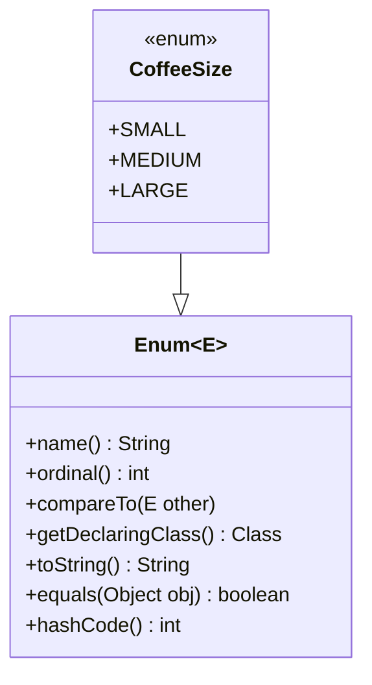

# Les enum en Java : bien plus que des constantes

> Il y a très longtemps, je ne comprenais pas l'intérêt des enums. Je les voyais comme des constantes pas pratiques parce que trop limitées. 
> Puis j'ai commencé à les utiliser dans des JTable Swing pour gérer mes colonnes. Depuis, je ne peux plus m'en passer.  
> Et aujourd'hui, j'en mets partout !


Dans cet article, **nous allons explorer ce que sont vraiment les enums en Java** afin de comprendre comment :
- les utiliser efficacement, et 
- éviter de tomber dans les pièges classiques.   

Car les enums sont puissantes. Et une grande puissance implique de grandes responsabilités.

<!-- truncate -->

## Qu'est-ce qu'une enum ?

Une `enum` (abréviation de "enumeration") est un type de données qui permet de définir un ensemble **fixe** et **nommé** de constantes. Une énum est bien plus qu'une simple liste de valeurs figées : une enum est une **classe spéciale** en Java.

Commençons par un exemple :

```java
public enum CoffeeSize {
    SMALL, MEDIUM, LARGE
}
```

Tu viens de créer un type `CoffeeSize`, avec trois valeurs possibles. Si tu essaies d'en utiliser une qui n'existe pas, ton code ne compile même pas : c'est le pouvoir du **type-safe**.

Mais attends, ce n'est que le début.

:::tip L'astuce de ton Dev Sensei
Je préfère écrire mes enums en [SCREAMING_SNAKE_CASE](/devento/transverse/cases#screaming_snake_case) puisque ce sont des constantes.  
De plus, j'en écris une par ligne pour la lisibilité.
:::

### Une enum est un objet

Contrairement aux idées reçues, une enum n'est pas juste une constante symbolique. **Une énum est un objet Java**. Elle peut :

- Avoir des attributs
- Avoir des méthodes
- Implémenter des interfaces
- Avoir un comportement propre à chaque constante
- Être utilisée dans des collections
- Être sérialisée (par défaut elle est `Serializable`)
- Être utilisée dans des `switch` (depuis Java 7) mais perso, j'évite.

### La classe Enum

**Toutes les enums héritent implicitement de la classe abstraite** `java.lang.Enum<E>`. Tu ne peux pas hériter d'une autre classe. Cette classe fournit des méthodes comme :

- `name()` : le nom de la constante, celui que tu as écrit.
- `ordinal()` : sa position dans l'enum (0 pour la première, 1 pour la deuxième, etc.)
- `compareTo()` : comparer deux enums, en fonction de leur position.
- `values()` : obtenir toutes les valeurs de l'enum sous forme de tableau.
- `valueOf(String name)` : obtenir une valeur d'enum à partir de son nom.



:::warning Attention aux Chocabugs© 
Ne jamais persister un `ordinal()` dans une base. Change l'ordre de tes enums et c'est la catastrophe assurée.
:::

## Convertir une chaîne en enum

**Il est fréquent de devoir convertir une chaîne de caractères** (souvent issue d'une requête, d'un formulaire ou d'un JSON) **en valeur d'enum. Java propose plusieurs façons de le faire**, avec des implications importantes.

Il existe deux méthodes, avec chacune ses avantages et inconvénients.

### La méthode par défaut

Il existe une methode `static` disponible dans toutes les enum `MonEnum.valueOf(String)`

```java
UserStatus status = UserStatus.valueOf("ACTIVE"); // OK
UserStatus status = UserStatus.valueOf("active"); // Exception !
````

**Bon à savoir** :
* Sensible à la casse.
* Lève une `IllegalArgumentException` si la valeur ne correspond pas exactement.
* À éviter pour des entrées non maîtrisées.
* Les librairies comme Jackson ou Gson utilisent cette méthode.

### La méthode personnalisée

**Tu peux aussi créer ta propre méthode de conversion**. Cette solution est plus flexible et totalement adaptable à tes besoins.  
Par exemple, tu ajoutes une méthode `static` `fromString()` dans ton enum :

```java
public static Optional<UserStatus> fromString(String input) {
    return Arrays.stream(UserStatus.values())
        .filter(status -> status.name().equalsIgnoreCase(input))
        .findFirst();
}
```

**Bon à savoir** :
* Tu peux la rendre insensible à la casse
* Tu peux ajouter autant de logique métier que nécessaire.
* Tu n'es pas obligé de lever d'exception.
* Idéal pour parser une valeur issue d'un formulaire, d'une API ou d'une config.

:::tip L'astuce de ton Dev Sensei
Utilise `valueOf()` quand tu es sûr à 100% de la valeur. Sinon, préfère un `fromString()` maison avec `equalsIgnoreCase()`. Tu peux même ajouter un fallback sur `Optional` ou une valeur par défaut.
:::


## Ajouter des attributs et des méthodes à une enum

**Tu peux associer des valeurs à tes constantes grâce à des attributs et constructeurs privés.**

```java
public enum Color {
    RED("#FF0000"),
    GREEN("#00FF00"), 
    BLUE("#0000FF");

    private final String hex;

    Color(String hex) {
        this.hex = hex;
    }

    public String getHex() {
        return hex;
    }
}
```

## Implémenter une interface avec une enum

```java
public interface Printable {
    void print();
}

public enum DocumentType implements Printable {
    PDF {
        public void print() {
            System.out.println("Impression PDF");
        }
    },
    WORD {
        public void print() {
            System.out.println("Impression Word");
        }
    },
    TEXT {
        public void print() {
            System.out.println("Impression Text");
        }
    }
}
```

Chaque constante peut fournir sa propre implémentation de l'interface. C'est du polymorphisme, version enum.

Tu peux aussi faire une méthode pour toutes les constantes :

```java
public enum DocumentType implements Printable {
    PDF, WORD, TEXT;

    @Override
    public void print() {
        System.out.println("Impression du document de type " + this.name());
    }
}
```


## Ajouter un comportement aux enums avec une méthode abstraite

**Tu peux définir une méthode `abstract` dans une enum, et l'implémenter différemment pour chaque constante.**

```java
public enum Operation {
    ADD { public int apply(int x, int y) { return x + y; } },
    SUB { public int apply(int x, int y) { return x - y; } },
    MUL { public int apply(int x, int y) { return x * y; } },
    DIV {
        public int apply(int x, int y) {
            if (y == 0) {
                throw new ArithmeticException("Division par zéro");
            }
            return x / y;
        }
    };

    public abstract int apply(int x, int y);
}
```

:::tip L'astuce de ton Dev Sensei 
Chaque constante devient une **classe anonyme** avec sa propre implémentation. Du vrai polymorphisme.

Et oui, tu n'as pas le mot clef `abstract` dans la déclaration de l'enum, mais tu peux quand même déclarer des méthodes abstraites.
:::


:::warning 
On le sait tous : _Un grand pouvoir implique de grandes responsabilités_.  
Fais attention de ne pas trop complexifier ton code avec des enums trop chargées.  
Si tu as plusieurs comportements, envisage de créer des classes séparées qui seront instanciées dans ton enum.
:::

## Le bon usage des valeurs d'une enum

**Le `switch` sur une enum est tentant, mais il rend ton code fragile.** Si tu ajoutes une nouvelle valeur à l'enum, tu dois penser à mettre à jour tous les `switch`. Partout, tout le temps.  
Et c'est pareil pour les `if` et les `else if`. 


**Mon astuce est d'ajouter un attribut à l'enum : un simple booléen est souvent suffisant.** Ça évite de multiplier les `switch` et de rendre le code plus lisible.

**Le code à éviter** 

```java
public enum UserStatus {
    ACTIVE,
    INACTIVE,
    BANNED
}
```

L'utilisation de cette enum ressemblera à ceci :

```java
class UserService {
    public void processUser(User user) {
        switch (user.getStatus()) {
            case ACTIVE:
                // Traitement pour les utilisateurs actifs
                break;
            case INACTIVE:
            case BANNED:
                // Traitement pour les utilisateurs inactifs
                break;
        }
    }
}
```

**Le code à privilégier**

```java
public enum UserStatus {
    ACTIVE(true),
    INACTIVE(false),
    BANNED(false);

    private final boolean isActive;

    UserStatus(boolean isActive) {
        this.isActive = isActive;
    }

    public boolean isActive() {
        return isActive;
    }
}
```

L'utilisation de cette enum ressemblera à ceci :

```java
class UserService {
    public void processUser(User user) {
        if (user.getStatus().isActive()) {
            // Traitement pour les utilisateurs actifs
        } else {
            // Traitement pour les utilisateurs inactifs
        }
    }
}
```

Pourquoi ?  
Parce que si tu rajoutes une nouvelle valeur à ton enum, tu n'as pas besoin de modifier **tout** le code qui l'utilise. Tu rajoutes ta ligne et c'est tout.

## EnumSet et EnumMap : les collections optimisées

* `EnumSet` : bien plus performant qu'un `HashSet` pour des enums
* `EnumMap` : map optimisée pour les enums comme clés

```java
EnumSet<DayOfWeek> weekEnd = EnumSet.of(DayOfWeek.SATURDAY, DayOfWeek.SUNDAY);
EnumMap<DayOfWeek, Integer> dayNumber = new EnumMap<>(DayOfWeek.class);
dayNumber.put(DayOfWeek.MONDAY, 1);
dayNumber.put(DayOfWeek.TUESDAY, 2);
dayNumber.put(DayOfWeek.WEDNESDAY, 3);
// ...
```

### Le comparatif 

| Critère                        | `EnumSet` / `EnumMap`                 | `HashSet<Enum>` / `HashMap<Enum, V>`      |
|--------------------------------|---------------------------------------|-------------------------------------------|
| **Performance**                | Excellente (bitset ou tableau indexé) | Bonne, mais plus coûteuse                 |
| **Mémoire**                    | Très optimisée                        | Plus gourmande                            |
| **Ordre garanti**              | Oui (ordre de déclaration des enums)  | Non                                       |
| **Null autorisé (clé/valeur)** | ❌ Non (ni clé ni valeur `null`)       | ✅ Oui                                     |
| **Type requis**                | Uniquement pour enums                 | Tout type (dont enums)                    |
| **Simplicité d'utilisation**   | Très simple avec enums                | Plus générique mais moins lisible         |
| **Cas d'usage typiques**       | Flags, permissions, mappage métier    | Usage générique, cas avec `null` autorisé |

:::tip L'astuce de ton Dev Sensei
Si tu travailles avec des enums et que tu veux une collection performante, propre et claire, **utilise `EnumSet` ou `EnumMap` sans hésiter**. Réserve `HashSet`/`HashMap` pour les cas plus génériques.
:::


## Enum et JPA

Tu peux persister une enum en base de données avec JPA. Par défaut, JPA utilise l'`ordinal`, la position, pour stocker les enums. Mais c'est risqué. Car si tu changes l'ordre des enums, tu perds la cohérence de tes données.

:::warning Attention aux Chocabugs© !
Imaginons un projet où le type d'utilisateur est porté par un enum tout simple : 

```java
public enum Role {
    USER, ADMIN, SUPER_ADMIN
}
```

Par souci de lisibilité, il est décidé de réordonner les enums par ordre alphabétique. 

```java
public enum Role {
     ADMIN, SUPER_ADMIN, USER
}
```

Intention louable, mais le résultat sera catastrophique. Tous les utilisateurs passeront de `USER` à `ADMIN`.

_Et paf, ça fait des Chocabugs© !_

Et bien sûr, on s'en apercevra en prod quand un utilisateur appellera le service utilisateurs pour dire qu'il ne comprend plus rien à l'interface, qu'on l'a trop changé, que c'est inadmissible...

Ça sent le vécu, hein ?
:::

Donc, je te conseille d'utiliser le `name()` de ton enum pour la persistance. Voici comment faire avec JPA :

```java
@Enumerated(EnumType.STRING) // ton sauveur !
private Status status;
```

Je me permets d'insister. Ne persiste pas l'`ordinal()` de ton enum. Utilise le `name()` à la place. C'est plus sûr et ça évite les surprises. 
Et ce traître de JPA utilise `EnumType.ORDINAL` par défaut, alors fais super attention !

:::tip L'astuce de ton Dev Sensei
1. Avec un peu de reflection, tu pourrais même faire un test unitaire qui vérifie que toutes tes entités.

2. En règle générale, n'utilise jamais l'`ordinal()` si cette valeur sort de ton application, par exemple pour l'exposer dans une API REST ou pour la persister en base de données.
:::

## Enums en DTO vs Entity : attention au mapping

Dans une application bien structurée, il est courant de **distinguer les enums utilisées côté entités** (modèle de persistance) de celles utilisées **dans les DTOs** (modèle exposé à l'extérieur, notamment via des APIs REST).

* Le modèle métier (entité JPA, domaine) utilise une `EntityEnum`, pensée pour le fonctionnement interne de l'application.
* Le modèle exposé (DTO, souvent sérialisé en JSON) utilise une `DtoEnum`, adaptée aux besoins des clients externes (nommage, visibilité, versioning...).
* Un **mapper explicite entre `EntityEnum` et `DtoEnum` est donc nécessaire** pour convertir proprement les données d'un modèle à l'autre.

Cela permet notamment de :

* conserver des libertés d'évolution internes sans casser l'API publique,
* faire évoluer l'interface tout en gardant une persistance cohérente,
* gérer des cas métier plus fins ou plus adaptés à l'exposition externe.

:::tip L'astuce de ton Dev Sensei
Pour vérifier mes mapping d'enum DTO \<--> Entity, j'ai une méthode un peu complexe, mais très utile :
- Je fais une interface `LinkedEnum<EnumDto>` que je mets sur toutes mes Enum Entity.
- Je fais un test unitaire qui vérifie que toutes les valeurs de toutes mes enum qui implémentent `LinkedEnum` sont présentes dans mes enum DTO. Et inversement.

Accroche-toi à ton clavier, je vais te donner le code de ce test unitaire :

1. Ton enum DTO ressemble à ça :
    ```java
    public enum DtoEnum {
        VALUE_1,
        VALUE_2,
        VALUE_3
    }
    ```
2. Crée une interface `LinkedEnum` :
    ```java
    public interface LinkedEnum<E extends Enum<E>> {}
    ```
3. Fais hériter ton enum de cette interface :
    ```java
    public enum EntityEnum implements LinkedEnum<DtoEnum> {
        VALUE_1,
        VALUE_2,
        VALUE_3
    }
   ```
4. Ajoute la dépendance suivante
   - dans ton `pom.xml` :
       ```xml
       <dependency>
           <groupId>org.reflections</groupId>
           <artifactId>reflections</artifactId>
           <version>0.10.2</version>
           <!-- en scope test, ça t'évitera de faire de la reflection tordue -->
           <scope>test</scope>
       </dependency>
       ``` 
    - Ou dans ton gradle :
       ```groovy
       testImplementation 'org.reflections:reflections:0.10.2'
       ```
5. Fais un test unitaire qui vérifie que toutes les valeurs de toutes tes enum qui implémentent `LinkedEnum` sont présentes dans tes enum DTO. Et inversement. Je t'en propose un sympa. Je te laisse lire le test, il est assez explicite :
    ```java
    import org.junit.jupiter.api.Assertions;
    import org.junit.jupiter.api.DisplayName;
    import org.junit.jupiter.api.function.ThrowingSupplier;
    import org.junit.jupiter.params.ParameterizedTest;
    import org.junit.jupiter.params.provider.Arguments;
    import org.junit.jupiter.params.provider.MethodSource;
    import org.reflections.Reflections;
    
    import java.lang.reflect.ParameterizedType;
    import java.lang.reflect.Type;
    import java.util.Arrays;
    import java.util.Set;
    import java.util.stream.Stream;
    
    import static org.junit.jupiter.api.Assertions.assertEquals;
    import static org.junit.jupiter.api.Assertions.assertTrue;
    
    class LinkedEnumTest {
    
        /**
         * @return toutes les classes qui implémentent {@link LinkedEnum}
         */
        @SuppressWarnings("rawtypes")
        static Stream<Arguments> findAllLinkedEnum() {
            Reflections reflections = new Reflections("base.package"); // ton package de base
            Set<Class<? extends LinkedEnum>> classes = reflections.getSubTypesOf(LinkedEnum.class);
            return classes.stream()
                .map(Arguments::of);
        }
    
        /**
         * @param rootEnumClass la classe de l'énumération
         * @param <E>           le type de l'énumération
         */
        @DisplayName("Vérifie que toutes les énumérations liées sont bien mappées")
        @MethodSource("findAllLinkedEnum")
        @ParameterizedTest
        <E extends Enum<E>> void should_all_linked_enum_are_mapped_correctly(Class<E> rootEnumClass) {
            // on vérifie que la classe est bien une énumération
            assertTrue(Enum.class.isAssignableFrom(rootEnumClass));
            // on récupère la classe de l'énumération liée
            Class<E> linkedEnumClass = resolveLinkedEnumType(rootEnumClass, LinkedEnum.class);
    
            // on récupère les valeurs des énumérations
            Enum<?>[] rootValues = rootEnumClass.getEnumConstants();
            Enum<?>[] linkValues = linkedEnumClass.getEnumConstants();
            assertEquals(rootValues.length, linkValues.length, "La taille des énumérations doit être la même");
    
            // on vérifie que toutes les valeurs de l'énumération liée sont bien mappées dans un sens
            Arrays.stream(rootValues)
                .<ThrowingSupplier<E>>map(rootValue -> () -> Enum.valueOf(linkedEnumClass, rootValue.name()))
                .forEach(Assertions::assertDoesNotThrow);
            // et dans l'autre sens
            Arrays.stream(linkValues)
                .<ThrowingSupplier<E>>map(linkValue -> () -> Enum.valueOf(rootEnumClass, linkValue.name()))
                .forEach(Assertions::assertDoesNotThrow);
        }
    
        /**
         * Récupère le type de l'interface implémentée par une classe.
         *
         * @param implementedClass la classe qui implémente l'interface
         * @param linkInterface    l'interface dont on veut récupérer le type
         * @return la classe du paramètre de l'interface
         */
        @SuppressWarnings("unchecked")
        private static <E extends Enum<E>> Class<E> resolveLinkedEnumType(Class<?> implementedClass, Class<?> linkInterface) {
            for (Type type : implementedClass.getGenericInterfaces()) {
                if (type instanceof ParameterizedType parameterizedType) {
                    Type rawType = parameterizedType.getRawType();
    
                    if (rawType instanceof Class<?> rawClass && linkInterface.isAssignableFrom(rawClass)) {
                        Type actualType = parameterizedType.getActualTypeArguments()[0];
                        if (actualType instanceof Class<?>) {
                            return (Class<E>) actualType;
                        }
                    }
                }
            }
            throw new RuntimeException("Could not resolve " + linkInterface.getName() + " type for " + implementedClass);
        }
    }
    ```

J'ai dit qu'il était _explicite_, mais pas forcément _facile à lire_...  
Je te l'explique dans les grandes lignes : 
- On utilise la librairie `Reflections` pour trouver toutes les classes qui implémentent `LinkedEnum` avec la méthode `findAllLinkedEnum`.
- Pour chaque classe, on vérifie qu'on a bien une énumération.
- On récupère la classe de l'énumération liée avec la méthode `resolveLinkedEnumType`.
- On vérifie que toutes les valeurs de l'énumération liée sont bien mappées dans un sens et dans l'autre.

Les avantages de ce test : 
- Si tu ajoutes des enums avec `LinkedEnum`, elles seront automatiquement testées.
- Si une valeur est ajoutée ou supprimée dans une enum et pas dans son enum liée, le test échouera.
- Il est paramétré, donc tu auras un résultat par enum.
- _Et surtout, je le trouve ultra classe avec ses générics et sa reflection._ 

Bref, une fois ce test en place, tu n'auras plus à le modifier. Il s'adaptera tout seul à tes enums. Même celles que tu n'as pas encore créées.

Je te laisse l'adapter si tu veux mapper tes enum grâce à un attribut.
:::

## Bonnes pratiques à retenir

- Utilise `SCREAMING_SNAKE_CASE` pour nommer les valeurs d'enums.
- Déclare une valeur d'enum **par ligne** pour plus de lisibilité.
- **Évite `ordinal()`** pour toute logique métier ou persistance : c'est fragile.
- Préfère `EnumType.STRING` à `ORDINAL` avec JPA pour la stabilité des données.
- Ne fais pas de `switch` sur des enums : ajoute un attribut ou une méthode dédiée à la place.
- Implémente des **interfaces** dans tes enums pour découpler la logique métier.
- Exploite les méthodes `abstract` dans les enums avec parcimonie.
- Utilise `EnumSet` et `EnumMap` plutôt que `HashSet` ou `HashMap` quand c'est possible.
- Si tu dois convertir une chaîne en enum :
   - Utilise `valueOf()` **seulement** si tu es certain de la valeur.
   - Sinon, fais un `fromString()` avec `equalsIgnoreCase()` + `Optional`.
- Distingue les enums d'entité (`EntityEnum`) des enums de DTO (`DtoEnum`) :
  - Utilise un **mapper explicite** entre les deux.
  - Et pense à tester leur cohérence avec un test unitaire automatique si possible.
- Garde tes enums **simples**. Si la logique devient trop complexe, externalise-la dans une classe métier.

## Pour aller plus loin

Voici quelques liens pour approfondir les sujets abordés dans cet article en attendant le prochain article !

- Documentation officielle
  - [Java Enum – Oracle](https://docs.oracle.com/javase/tutorial/java/javaOO/enum.html) : Le point d'entrée de la doc officielle sur les enums, avec exemples de base
  - [Classe `java.lang.Enum`](https://docs.oracle.com/en/java/javase/21/docs/api/java.base/java/lang/Enum.html) : Description complète de la classe `Enum<E>` et des méthodes héritées par toutes les enums.
- Articles de référence
  - [Baeldung - Tous les articles sur les Enums](https://www.baeldung.com/tag/enums) : Très complet, couvre tous les usages (constructeurs, interfaces, méthodes, JPA, JSON, tests).
  - [Guide to EnumSet](https://www.baeldung.com/java-enumset) : Un article très complet sur `EnumSet`, ses avantages et ses inconvénients.
  -[Guide to EnumMap](https://www.baeldung.com/java-enummap) : Un article très complet sur `EnumMap`, ses avantages et ses inconvénients.
  - [Persisting Enums in JPA](https://www.baeldung.com/jpa-persisting-enums-in-jpa) : Un article très complet sur la persistance des enums en JPA, avec des exemples de code.
- Wikipédia
  - [Enumerated type](https://en.wikipedia.org/wiki/Enumerated_type#Java) : Partie Java de l'article général sur les types énumérés.
- Bonus utiles
  - [Vlad Mihalcea - The best way to map an Enum Type with JPA and Hibernate](https://vladmihalcea.com/the-best-way-to-map-an-enum-type-with-jpa-and-hibernate/) : Un article clair et tranché sur les erreurs fréquentes en JPA.

## Conclusion

Les enums sont sous-estimées. Et pourtant, elles peuvent grandement clarifier ton code, structurer ton métier, t'éviter de nombreuses erreurs, et même te faire gagner du temps de développement.

Bref, en un mot (ou deux) comme en cent : **utilise-les !**

Prêt à énumérer tes idées dans ton prochain projet Java ?

---

Merci d'avoir pris le temps de lire cet article ! J'espère qu'il t'aura été utile et que tu as appris quelque chose de nouveau.

Si tu as envie que j'explique plus avant certains concepts ou que je parle de quelque chose en particulier, n'hésite pas à me le dire dans les commentaires.

Pour ne pas rater les prochains articles, abonne-toi à un flux (tu as le choix entre [RSS](https://dev-sensei.digicrafters.fr/blog/rss.xml), [Atom](https://dev-sensei.digicrafters.fr/blog/atom.xml) et [Json](https://dev-sensei.digicrafters.fr/blog/feeed.json)) ou à la newsletter en [page d'accueil](/) !
