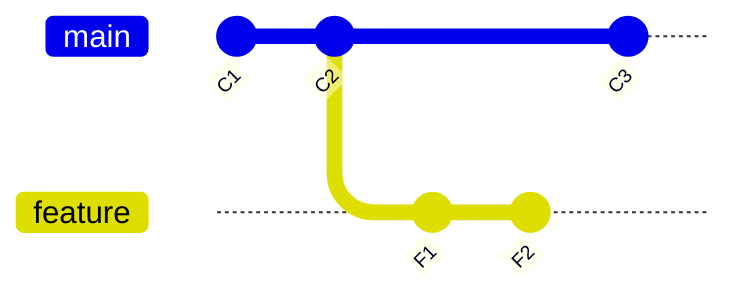
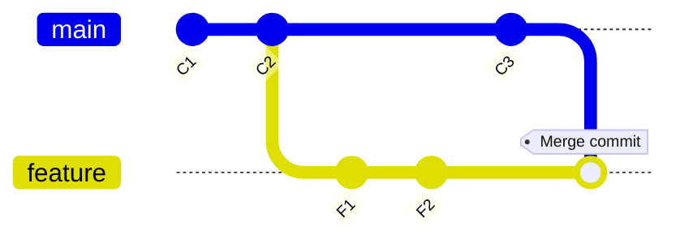
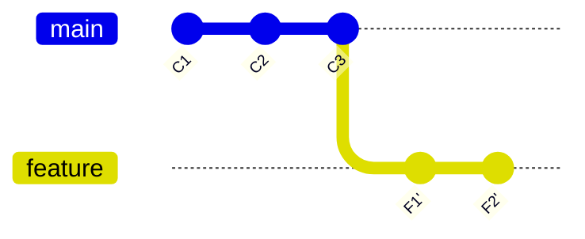

---
last_update:
  date: 03/18/2025
title: Rebase vs Merge 🥊
tags:
  - git
  - développement
# pour ajouter des tags à la page
keywords:
  - devento
  - aide-mémoire
  - fiche technique
# pour ajouter meta description à la page
description: Fiche technique et aide-mémoire pour faire la différence entre git rebase et git merge
---

## `git merge main` sur `feature`

### Avant le merge

Avant la fusion, `feature` et `main` ont divergé : `main` a un commit `C3`, et `feature` a `F1` et `F2`.

### Après le merge

Après la fusion, un **commit de merge** est créé pour réunir les deux branches.

🔹 **Un commit de fusion est ajouté**, conservant l'historique des deux branches.  
🔹 L'historique garde une trace de la divergence et du moment où `feature` a fusionné `main`.

---

## `git rebase main` sur `feature`

### Avant le rebase

Avant l'exécution de `git rebase main`, `feature` a divergé avec `main`, qui a reçu un commit `C3`.

### Après le rebase

Avec `git rebase main`, les commits `F1` et `F2` sont **rejoués** sur le sommet de `main`, supprimant la divergence.

🔹 **L'historique devient linéaire** : les commits de `feature` sont repositionnés **après** `C3`.  
🔹 **Les commits `F1` et `F2` sont réécrits** (`F1'` et `F2'` ont maintenant de nouveaux identifiants de commit).

---

## Résumé

| Opération  | Avantages                                      | Inconvénients                                             |
|------------|------------------------------------------------|-----------------------------------------------------------|
| **Merge**  | Conserve l'historique avec toutes les branches | Ajoute un commit de fusion                                |
| **Rebase** | Historique linéaire, plus lisible              | Réécrit l'historique, à éviter sur des branches partagées |

 ## Quand utiliser quoi ?

- **Utilise `merge`** pour une intégration sécurisée, surtout dans un travail collaboratif.
- **Utilise `rebase`** pour une histoire propre, mais évite sur une branche déjà poussée.

**⚠️Règle d'or : Ne jamais rebaser une branche déjà partagée avec d'autres développeurs !**

---

_Cette fiche a été publiée en premier sur https://nathaniel-vaur-henel.github.io/ par [Nathaniel Vaur Henel](https://nathaniel-vaur-henel.github.io/crafters/nathaniel-vaur-henel) sous licence [Attribution 4.0 International](https://creativecommons.org/licenses/by/4.0/)_
