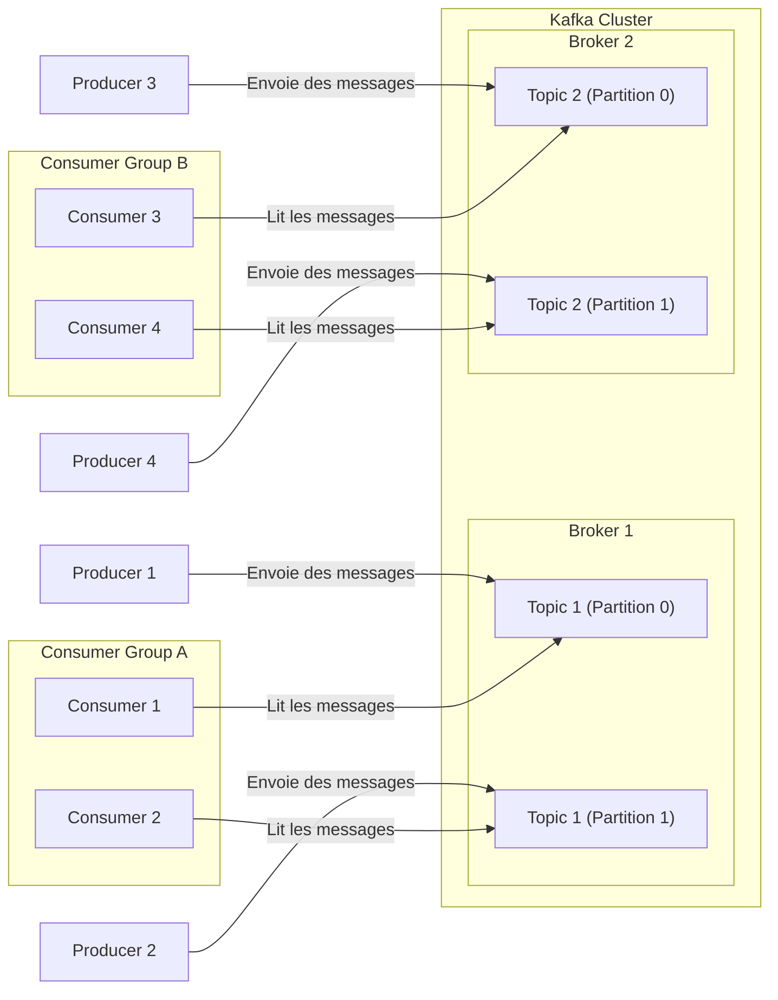

---
last_update:
  date: 02/03/2025
tags:
  - Kafka
  - architecture
  - développement
# pour ajouter des tags à la page
keywords:
  - devento
  - architecture
  - aide-mémoire
  - fiche technique
# pour ajouter meta description à la page
description: Fiche technique et aide-mémoire pour comprendre Kafka
---

# Kafka : Présentation

Parlons un peu littérature : Franz Kafka est un écrivain austro-hongrois. Il est considéré comme l'un des écrivains majeurs du XXe siècle. Son œuvre est vue comme symbole de l'homme déraciné des temps modernes... Merci [Wikipédia](https://fr.wikipedia.org/wiki/Franz_Kafka)

Finalement, non, nous allons plutôt parler d'[Apache Kafka](https://fr.wikipedia.org/wiki/Apache_Kafka) qui tire son nom du premier. Il paraît que le nom sonnait bien pour un système qui traite des **flux de messages complexes et massifs**, tout comme les œuvres de Franz Kafka explorent des structures labyrinthiques et déroutantes.

Cependant, contrairement aux histoires de Franz qui évoquent souvent l'inefficacité et l'oppression, notre Apache Kafka est conçu pour simplifier et fluidifier la communication entre systèmes.

## La fiche technique

## 1. Qu'est-ce que Kafka ?

Kafka est une **plateforme de streaming distribuée** qui permet de traiter et de transmettre des données en temps réel. Il est particulièrement conçu pour **gérer des flux de messages** dans des systèmes complexes, là où les appels API classiques montrent leurs limites.

## 2. Les Composants clefs de Kafka

### Producers (Producteurs)

Un **producer** (producteur) dans Kafka est une application ou un service qui **envoie des messages** dans un ou plusieurs **topics**. Il génère des données ou des événements qu’il souhaite transmettre à d’autres systèmes ou applications via Kafka.

- **Rôle** : Le producteur est responsable de la création et de l’envoi des événements dans Kafka. Il peut choisir le topic dans lequel les messages seront publiés, et Kafka se charge de les acheminer correctement.
- **Exemple** : Une application de commande en ligne peut être un producteur qui envoie un message à Kafka chaque fois qu'une nouvelle commande est passée, afin que d'autres systèmes (comme la gestion des stocks ou le service de facturation) puissent y accéder et traiter l’événement.

### Consumers (Consommateurs)

Un **consumer** (consommateur) est une application ou un service qui **lit** les messages publiés dans Kafka. Contrairement aux producteurs, qui envoient des messages, les consommateurs sont chargés de récupérer et de traiter ces messages.

- **Rôle** : Le consommateur se **connecte** à un ou plusieurs topics Kafka et **lire les messages** qu’ils contiennent. Il peut être configuré pour traiter les messages de manière séquentielle, ou pour les lire en parallèle afin d’optimiser le traitement.
- **Exemple** : Un système de gestion des stocks pourrait être un consommateur qui lit les messages des commandes passées (produits par les producteurs) pour mettre à jour les niveaux de stock dans la base de données.

### Topics

Un **topic** dans Kafka est une **catégorie** ou un **canal** dans lequel les messages sont envoyés par les producteurs et auxquels les consommateurs peuvent s'abonner pour recevoir des messages.

- **Rôle** : Un topic sert à organiser et catégoriser les messages en fonction de leur sujet.
- **Exemple** : Si vous avez un système de gestion des commandes, vous pourriez avoir un topic nommé `commande-reçue` pour tous les messages relatifs à la réception de nouvelles commandes.

Les topics permettent de **séparer les types de messages** dans des flux indépendants, ce qui facilite leur gestion, leur stockage et leur traitement.

### Messages

Les messages sont les **unités de données** envoyées dans Kafka. Chaque message contient une **clé**, une **valeur** et éventuellement un **timestamp**.

- **Message** : Un événement ou une donnée brute envoyée par un producteur dans un topic.
- **Exemple** : Un message pourrait être un enregistrement indiquant qu'une commande a été reçue : `{ "orderId": "12345", "status": "received", "timestamp": "2025-02-05T12:00:00Z"}`.

Kafka permet de traiter **de grandes quantités de messages** (ou événements) de manière **asynchrone**, sans que les systèmes producteurs et consommateurs soient directement liés.

Chaque message possède un **offset**, un **identifiant unique** dans un **topic**, ce qui permet de suivre et de relire les messages.

## 3. Problèmes résolus par Kafka par rapport aux appels API classiques

### Problème 1 : Couplage des systèmes

**Appels API classiques** : Les systèmes appelants et appelés sont souvent fortement **couplés**. Un appel API nécessite que le système destinataire soit disponible et réactif pour répondre à la requête. Cela peut causer des **bouchons** et des **pannes**.

**Kafka** : Kafka découple les producteurs des consommateurs grâce à son modèle **publish-subscribe**. Les producteurs envoient des messages dans un topic, et les consommateurs peuvent les traiter à leur propre rythme, sans dépendre de la disponibilité immédiate du producteur. Cela résout les problèmes de **couplage direct** entre les systèmes. De plus, Kafka offre un mécanisme de file d'attente de messages, ce qui permet de **bufferiser** les données en attendant que les consommateurs les traitent à leur rythme.

### Problème 2 : Scalabilité

**Appels API classiques** : Les appels API peuvent devenir un goulot d'étranglement lorsqu'un grand nombre d'appels simultanés sont effectués, en raison des **limites de capacité** des serveurs et des systèmes impliqués.

**Kafka** : Kafka peut traiter des **millions de messages par seconde** grâce à son architecture distribuée et sa capacité à se **scaler horizontalement**. Il peut ainsi gérer de très grands volumes de données sans impact majeur sur les performances, ce qui le rend bien plus adapté pour les applications nécessitant une haute **scalabilité**.

### Problème 3 : Traitement asynchrone et latence

**Appels API classiques** : Les appels API sont généralement **synchrone**, ce qui signifie que le système appelant attend une réponse immédiate du système appelé. Cela peut entraîner des **temps d'attente** longs et une **latence** élevée.

**Kafka** : Kafka fonctionne de manière **asynchrone**, permettant aux consommateurs de traiter les messages lorsqu'ils sont prêts, sans attendre que le producteur ou d'autres consommateurs répondent. Cela permet de réduire la latence et d'améliorer la réactivité du système global.

### Problème 4 : Perte de données et résilience

**Appels API classiques** : Les appels API peuvent échouer ou perdre des informations en cas de **pannes réseau**, de **problèmes serveur**, ou de **déconnexion** entre les systèmes.

**Kafka** : Kafka garantit la **persistance des messages** grâce à son système de stockage sur disque et à sa **réplication** des messages entre plusieurs brokers. En cas de panne d'un broker, les messages sont récupérables à partir des réplicas, ce qui garantit une **résilience élevée** et une **tolérance aux pannes**.

### Problème 5 : Gestion de la complexité et des dépendances

**Appels API classiques** : Les systèmes interconnectés via des API doivent gérer des chaînes complexes d'appels, ce qui peut devenir difficile à maintenir à mesure que l'application évolue. Cela entraîne une complexité croissante dans la gestion des **dépendances**.

**Kafka** : Kafka simplifie cette gestion en permettant un **modèle de communication découplé**. Les producteurs envoient des messages dans des topics sans connaître les consommateurs qui les traiteront. Les consommateurs peuvent se connecter à un ou plusieurs topics sans interférer avec les autres systèmes, réduisant ainsi la complexité de l'architecture. De plus, Kafka permet de faciliter l'évolutivité des applications, en permettant aux systèmes de se développer indépendamment, tout en conservant une communication fiable.

### Problème 6 : Historique des données

**Appels API classiques** : Les API ne permettent pas de conserver un **historique des appels** ou des données échangées sur le long terme. Si une donnée est perdue ou non traitée à un moment donné, elle est souvent irrécupérable.

**Kafka** : Kafka permet de stocker les messages dans les topics pendant une période définie (paramétrable), ce qui permet de **rejouer les événements** ou de récupérer des données passées à tout moment, même si elles ont été envoyées il y a plusieurs jours. Cela est particulièrement utile pour les cas d'usage nécessitant de **l'archivage** ou de l'**analyse de données historiques**.

## 4. Comparaison entre Kafka et les API Classiques

| Problème                      | API Classiques                               | Kafka                                                                          |
|-------------------------------|----------------------------------------------|--------------------------------------------------------------------------------|
| **Couplage des systèmes**     | Fortement couplé                             | Découplage complet entre producteurs/consommateurs                             |
| **Scalabilité**               | Goulot d'étranglement en cas de forte charge | Scalabilité horizontale, capable de gérer de grands volumes                    |
| **Latence**                   | Temps de réponse immédiat requis             | Traitement asynchrone avec faible latence                                      |
| **Tolérance aux pannes**      | Risque de perte de données en cas de panne   | Haute résilience et stockage des messages sur disque                           |
| **Complexité et dépendances** | Chaînes d'appels API complexes et fragiles   | Communication découplée et indépendante entre systèmes                         |
| **Historique des données**    | Pas d'historique des appels                  | Conservation des messages pendant un temps configurable                        |
| **Gestion de la charge**      | Risque de surcharge d'un serveur unique      | Répartition automatique sur plusieurs partitions, message envoyé en **batchs** | 
| **Traitement parallèle**      | Les API doivent gérer les appels simultanés  | Plusieurs consommateurs peuvent traiter en parallèle                           | 

## 5. Schéma de fonctionnement

Voici un diagramme représentant le fonctionnement de **Kafka** avec les **Producers**, **Topics**, **Brokers**, et **Consumers** :

- Les **Producers** (P1, P2, P3, P4) **publient des messages** dans les **Topics** gérés par Kafka.
- Les **Topics** sont **partitionnés** (ex : `Topic 1` a `Partition 0` et `Partition 1`).
- Les **Brokers** sont les serveurs Kafka qui stockent ces partitions.
- Les **Consumers** (C1, C2, C3, C4) **lisent les messages** des topics.
- Les **Consumers peuvent être regroupés** dans des **Consumer Groups** (ex : `Consumer Group A` lit `Topic 1`, `Consumer Group B` lit `Topic 2`).
- Un **Consumer Group** assure qu'un **message d'une partition est lu par un seul consommateur à la fois**, permettant le **traitement parallèle**.

Ce schéma illustre le fonctionnement général de Kafka dans un environnement distribué et scalable.

Le modèle partitionné permet de **scaler horizontalement**, et donc d’ajouter des consommateurs et producteurs selon les besoins.

## 6. Conclusion

Kafka est une solution moderne et robuste pour les entreprises ayant besoin de gérer des flux de données massifs en temps réel, en réduisant les problèmes liés aux appels API classiques, notamment en termes de scalabilité, de résilience, et de gestion des dépendances. Grâce à son modèle basé sur les **topics** et les **messages**, Kafka permet de mieux gérer les événements, la persistance des données et l'intégration des systèmes sans compromettre les performances.

## Ressources

### Sources

- [Architecture - Apache Kafka](https://kafka.apache.org/11/documentation/streams/architecture) : décrit en détail l'architecture de Kafka Streams, expliquant comment elle simplifie le développement d'applications en s'appuyant sur les bibliothèques **producer** et **consumer** de Kafka.
- [Difference between Kafka and REST API](https://rapidapi.com/guides/difference-kafka-rest) : un article qui compare les API de Kafka aux API REST, en soulignant les différences fondamentales entre ces deux architectures.
- [HTTP and REST APIs with Apache Kafka - Confluent](https://www.confluent.io/blog/http-and-rest-api-use-cases-and-architecture-with-apache-kafka/) : un article qui explore l'interface RESTful de Kafka, facilitant la production et la consommation de messages via HTTP(S) au lieu du protocole Kafka natif.
- [Introduction to Apache Kafka | Confluent Documentation](https://docs.confluent.io/kafka/introduction.html) : une introduction à Kafka en tant que plateforme de streaming d'événements distribuée, conçue pour gérer de grands volumes de données de manière évolutive et tolérante aux pannes.
- [Kafka vs. Other Systems (REST, Enterprise Service Bus, Database)](https://developer.confluent.io/learn/event-streaming-vs-related-trends/) : ce guide compare Kafka aux systèmes de messagerie traditionnels, en abordant les idées reçues courantes et en fournissant des directives d'utilisation.
- [Wikipédia - Franz Kafka](https://fr.wikipedia.org/wiki/Franz_Kafka) : la page Wikipédia de l'auteur à qui Apache Kafka doit son nom.
- [Wikipédia - Apache Kafka](https://fr.wikipedia.org/wiki/Apache_Kafka) : la page Wikipédia d'Apache Kafka, dont on parle ici.

### Fiches à télécharger

Tu peux télécharger ce devento en plusieurs formats :
- [pdf](kafka_aide-mémoire.pdf)
- [md](kafka_aide-mémoire.markdown)

---

_Cette fiche a été publiée en premier sur https://nathaniel-vaur-henel.github.io/ par [Nathaniel Vaur Henel](https://nathaniel-vaur-henel.github.io/crafters/nathaniel-vaur-henel) sous licence [Attribution 4.0 International](https://creativecommons.org/licenses/by/4.0/)_
